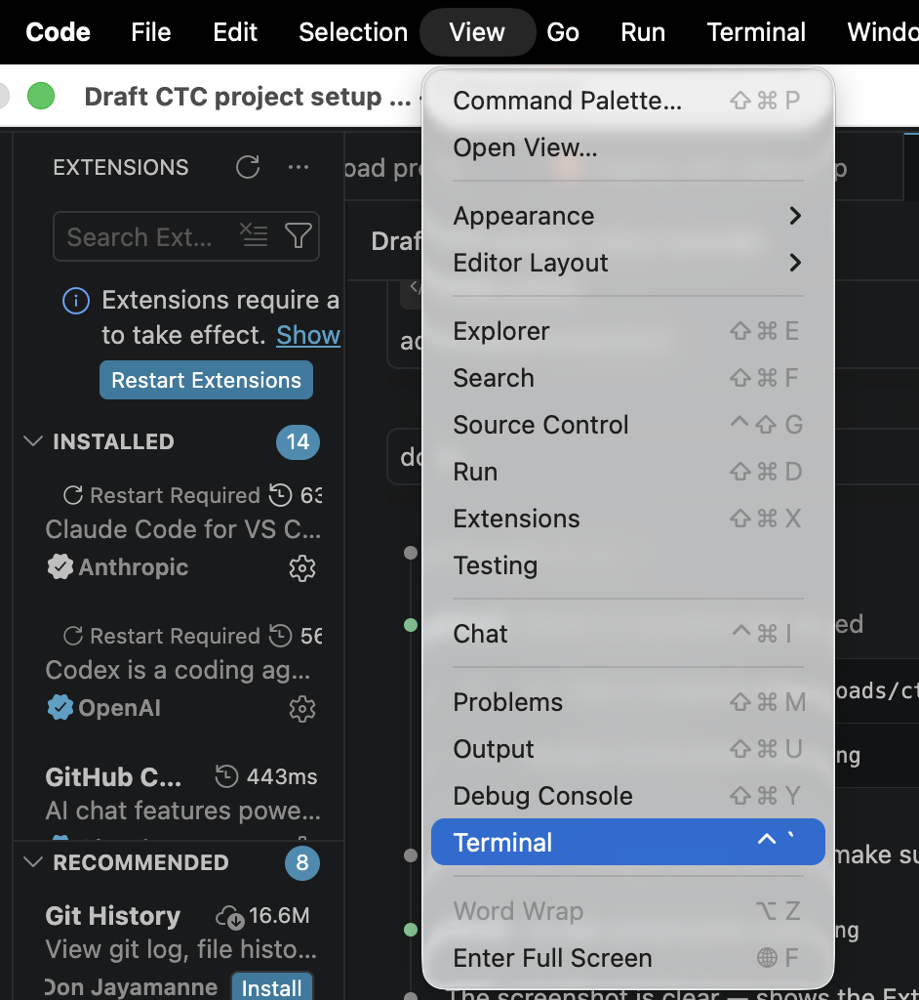
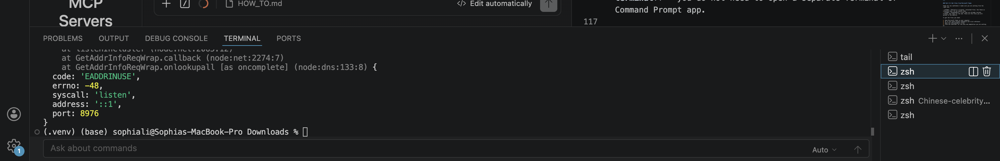
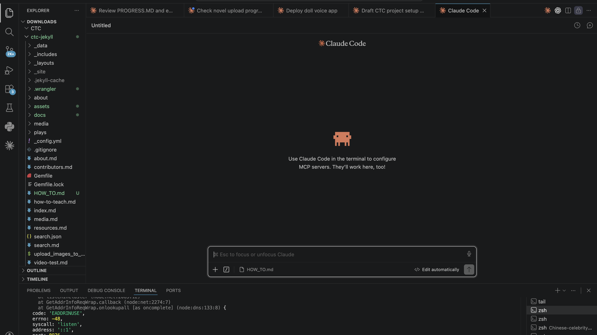

# How to Work on the CTC Website

This guide is for anyone who wants to add or edit content on the Chinese Theater Collaborative website. No coding experience needed.

It covers both **Mac** and **Windows** computers. Look for the Mac 🍎 and Windows 🪟 labels to find the instructions for your system.

---

## How This Project Is Organized

The CTC website uses four separate systems. It is important to understand what each one is for before you start.

| System | What it stores | Role |
|---|---|---|
| **Microsoft Teams** | All media files — both original source files and processed files ready for the web | Central media storage for the whole team |
| **GitHub** | Website code and text files (`.md` pages, templates, navigation) — no media | Working files — what contributors edit |
| **Cloudflare R2** | Processed, web-ready images and video clips (copied from Teams) | Distribution — files served directly to website visitors |
| **Reclaim Hosting** | The final published website visible to the public | Publication — managed by project manager only |

### Microsoft Teams folder structure

Teams is organized into two subfolders to keep source and processed files separate:

```
Teams: CTC Project Files/
│
├── Source/                    ← Original, untouched files
│   ├── mulan/
│   │   ├── 1956-opera-film/
│   │   │   ├── Mulan_1956_raw_scan_1.tif
│   │   │   └── Mulan_1956_fullvideo.mov
│   │   └── ...
│   └── ...
│
└── Processed/                 ← Edited, web-ready files (correct size, format, trimmed)
    ├── mulan/
    │   ├── 1956-opera-film/
    │   │   ├── Mulan_1956_OperaFilm_1.jpg
    │   │   └── Mulan_1956_Clip_1.mp4
    │   └── ...
    └── ...
```

- **Source/** — raw files exactly as received (high-res scans, full-length recordings). Do not modify these.
- **Processed/** — files that have been resized, cropped, or trimmed and are ready to upload to the website. These are the files you upload to Cloudflare R2.

### The typical workflow

```
Teams/Source    →   Teams/Processed   →   Cloudflare R2   →   Reclaim Hosting
─────────────       ───────────────       ─────────────       ───────────────
Raw originals   →   Edit/trim/resize  →   Upload for web  →   Live website
                                          + GitHub for
                                            .md files
```

**Step by step:**

1. Find your raw source files in **Teams / Source/**
2. Edit, resize, or trim them as needed and save to **Teams / Processed/**
3. Download files from Teams and write or edit the page content in `.md` files **locally on your computer**
4. Upload processed images and video clips from your computer to **Cloudflare R2**
5. Test your changes locally on your own computer (see Section 3)
6. Run the accessibility check using the tools in **Teams / Accessibility/** (see Section 8)
7. Push your finished `.md` files to **GitHub**
8. The project manager publishes the final site to **Reclaim Hosting**

---

## Table of Contents

1. [What You Need to Install](#1-what-you-need-to-install)
2. [Get the Files on Your Computer](#2-get-the-files-on-your-computer)
3. [Preview the Website on Your Computer](#3-preview-the-website-on-your-computer)
4. [How the Website Is Organized](#4-how-the-website-is-organized)
5. [How to Edit an Existing Page](#5-how-to-edit-an-existing-page)
6. [How to Add a New Play](#6-how-to-add-a-new-play)
7. [How to Add an Adaptation Module](#7-how-to-add-an-adaptation-module)
8. [Run the Accessibility Check](#8-run-the-accessibility-check)
9. [How to Publish Your Changes](#9-how-to-publish-your-changes)
10. [Using Claude Code (AI) to Generate and Edit Content](#10-using-claude-code-ai-to-generate-and-edit-content)

### Companion Guides

Detailed guides for specific tasks. This document links to each one where it comes up, but they are all listed here so you can find them directly.

| Guide | Use it when you are… |
|---|---|
| [Subtitles, Sound Labels, and Audio Descriptions](HOW_TO_subtitles_and_audio.md) | Creating the accessibility files for a video clip |
| [Clip Sourcing and Alignment](HOW_TO_clip_source_and_alignment.md) | Looking for a clearer source for a clip, or re-cutting one so its subtitles and audio description still line up |
| [Topaz Upscaling](HOW_TO_topaz_upscaling.md) | Improving a clip's quality when no clearer source exists |
| [Alt Text](HOW_TO_alt_text.md) | Writing the description of an image for screen readers |

---

## 1. What You Need to Install

You only need to do this once.

> **Tip: Let an AI agent do the installation for you.**
> Instead of running each command yourself, you can ask a coding AI agent like **Claude Code** to walk you through the entire setup. See the example prompts at the end of this section.

---

### Step A — Download and set up Visual Studio Code

Download **Visual Studio Code** (free, works on Mac and Windows):
https://code.visualstudio.com

VS Code is where you will write and edit all the website content. It also has a **built-in terminal** so you can run commands without opening a separate app, and a **Claude Code extension** so you can use AI assistance directly inside VS Code.

#### Install the Claude Code extension

1. Open VS Code
2. Click the **Extensions** icon in the left sidebar — or press `Ctrl+Shift+X` on Windows / `⌘+Shift+X` on Mac

   
3. Search for **Claude Code**
4. Click **Install**

Once installed, you can open Claude Code with the button in the bottom status bar or by pressing `Ctrl+Shift+P` (Windows) / `⌘+Shift+P` (Mac) and searching "Claude Code".

#### Open the built-in terminal

All commands in this guide should be typed in the **VS Code terminal** — you do not need to open a separate Terminal or Command Prompt app.

To open the terminal inside VS Code:
- Go to **View → Terminal** in the menu, or
- Press `` Ctrl+` `` (Windows) / `` ⌘+` `` (Mac)



A terminal panel will open at the bottom of VS Code. This is where you will type all commands.



**🪟 Windows only — set Git Bash as your terminal**

VS Code on Windows defaults to PowerShell, which does not work well with this project. Switch it to Git Bash:

1. First download and install **Git for Windows**: https://git-scm.com/download/win (accept all default options during installation)
2. In VS Code, press `Ctrl+Shift+P` and search **Terminal: Select Default Profile**
3. Choose **Git Bash** from the list

> A dropdown menu will appear at the top of the screen listing available terminal options — select **Git Bash**.

From now on, every time you open the terminal in VS Code it will use Git Bash.

---

### Step B — Install Ruby

Ruby is the programming language that Jekyll (the website builder) runs on.

**🍎 Mac**

First install Homebrew (a tool that installs other tools):

```
/bin/bash -c "$(curl -fsSL https://raw.githubusercontent.com/Homebrew/install/HEAD/install.sh)"
```

Then install Ruby:

```
brew install ruby
```

Then add Ruby to your path (copy and paste this whole line):

```
echo 'export PATH="/opt/homebrew/opt/ruby/bin:$PATH"' >> ~/.zshrc && source ~/.zshrc
```

**🪟 Windows**

Go to https://rubyinstaller.org/downloads/ and download the version labeled **Ruby+Devkit (recommended)**.

Run the installer. When it finishes, a black window will open and ask you to press Enter — press Enter, then wait for it to finish.

---

### Step C — Install Jekyll

This command is the same on both Mac and Windows — type it in the VS Code terminal:

```
gem install bundler jekyll
```

---

### Step D — Install Python (for subtitle and audio description scripts)

Python is needed to run the Gemini and OpenAI scripts used to generate sound labels and audio descriptions.

**🍎 Mac**
```
brew install python
```

**🪟 Windows**
Download and install Python from https://www.python.org (click "Latest Release"). During installation, check the box **"Add Python to PATH"**.

Then install the required packages (same on both systems):
```
pip install google-generativeai openai
```

#### Install the Python extension in VS Code

1. Open VS Code and click the **Extensions** icon ( `⊞` ) in the left sidebar
2. Search for **Python** (published by Microsoft)
3. Click **Install**

---

### Step E — Install Wrangler (for uploading images and videos)

Wrangler is the tool used to upload media files to the cloud. First install Node.js:

**🍎 Mac**
```
brew install node
```

**🪟 Windows**
Download and install Node.js from https://nodejs.org (click the "LTS" version).

Then install Wrangler (same on both systems):

```
npm install -g wrangler
```

Then log in to Cloudflare:

```
wrangler login
```

A browser window will open — log in with the project's Cloudflare account credentials.

---

### Step F — Install the video tools (for sourcing and cutting clips)

These are needed to download a video segment from YouTube, cut it, and re-encode it for the web — see the [clip sourcing and alignment guide](HOW_TO_clip_source_and_alignment.md). You only need them if you are working with video clips.

> **On a university or work computer, check your IT policy before installing or using these.** All three are free and open-source and run locally, but some institutions require approval for any installed software. In particular, downloading from YouTube with yt-dlp may raise terms-of-service or copyright questions — confirm with the project supervisor or OSU IT that your use is cleared before relying on it.

- **yt-dlp** — downloads a segment from YouTube (or similar sites)
- **ffmpeg** — cuts, trims, and re-encodes the clip; also extracts frames and measures audio
- **deno** — a JavaScript runtime that yt-dlp needs in order to list every available resolution

**🍎 Mac**
```
brew install yt-dlp ffmpeg deno
```

**🪟 Windows**
```
winget install yt-dlp.yt-dlp Gyan.FFmpeg DenoLand.Deno
```
(Or download ffmpeg from https://ffmpeg.org/download.html and add it to your PATH.)

> **Keep yt-dlp up to date.** YouTube changes often, and an outdated yt-dlp may fail to download or silently hide the higher-resolution formats — so you could reject a source that is actually better. Update it with `brew upgrade yt-dlp` (Mac) or `winget upgrade yt-dlp.yt-dlp` (Windows).

---

### Using Claude Code to complete the installation

If you are not comfortable running commands yourself, you can use **Claude Code** — the AI assistant built into VS Code — to guide you through or complete the entire installation automatically.

#### How to open Claude Code in VS Code

1. Make sure you have installed the **Claude Code extension** (see Step A above)
2. Open the `ctc-jekyll` project folder in VS Code:
   - Go to **File → Open Folder**
   - Select the `ctc-jekyll` folder on your computer
   - Click **Open**

   > This step is important — Claude Code needs to know which project you are working on. Always open the folder before starting Claude Code.

3. Open the Claude Code panel by clicking its icon in the left sidebar, or press `Ctrl+Shift+P` (Windows) / `⌘+Shift+P` (Mac) and search **Claude Code: Open**

   

4. Type your request in the chat box and press Enter — Claude Code can read your project files and run commands in the VS Code terminal on your behalf

#### Example prompts for installation

Copy and paste any of these prompts directly into Claude Code:

---

**Check what is already installed:**
```
I am setting up the CTC Jekyll website on my [Mac / Windows] computer.
Please check whether Ruby, Bundler, Jekyll, Node.js, and Wrangler are 
already installed, and tell me what still needs to be installed.
```

---

**Run the full setup from scratch:**
```
I need to set up the CTC Jekyll website on my [Mac / Windows] computer 
from scratch. Please install the following tools in the correct order:
1. Homebrew (Mac only)
2. Ruby and Bundler
3. Jekyll
4. Python and the pip packages: google-generativeai openai
5. Node.js
6. Wrangler (Cloudflare CLI)
7. (Only if I will work with video clips) yt-dlp, ffmpeg, and deno

After each step, confirm it was successful before moving to the next one.
```

---

**Fix a specific error:**
```
I tried to run "bundle exec jekyll serve" and got this error:

[paste the error message here]

I am on a [Mac / Windows] computer. Please diagnose and fix the problem.
```

---

**Install only what is missing:**
```
I already have Ruby installed on my Mac but I'm getting an error when 
I run "gem install bundler jekyll". The error says:

[paste the error message here]

Please fix this and complete the Jekyll installation.
```

---

**Set up Wrangler and log in to Cloudflare:**
```
Please install Wrangler (the Cloudflare CLI tool) on my [Mac / Windows] 
computer and walk me through logging in to the CTC Cloudflare account.
```

---

## 2. Get the Files on Your Computer

There are three places where project files are stored. You need to get files from each one.

---

### Part A — Get the website code from GitHub

GitHub stores all the `.md` page files, templates, and navigation data. To download them, open the **VS Code terminal** (View → Terminal) and run:

**🍎 Mac**
```
cd ~/Documents
git clone https://github.com/CTC2026/ctc-jekyll.git
```

**🪟 Windows**
```
cd /c/Users/YourName/Documents
git clone https://github.com/CTC2026/ctc-jekyll.git
```

Replace `YourName` with your actual Windows username.

This creates a `ctc-jekyll` folder on your computer. Then enter the folder and install the required tools:

```
cd ctc-jekyll
bundle install
```

---

### Part B — Get files from Microsoft Teams

Teams has two subfolders — make sure you are working from the right one:

- **Teams / Source/** — original, untouched files. Use these as reference only. Do not modify them.
- **Teams / Processed/** — files that are already resized, trimmed, and ready for the web. These are the files you will upload to the website.

To get the files you need:

1. Open Microsoft Teams on your computer
2. Go to the **CTC project channel** and click **Files**
3. Open the **Processed/** folder
4. Find the subfolder for the play and adaptation you are working on
5. Download the images and video clips to your computer
6. Place them in the matching subfolder inside `ctc-jekyll/assets/`:

```
ctc-jekyll/assets/plays/mulan/1956-opera-film/
```

> If the files you need are not yet in **Processed/**, you will need to edit them from **Source/** first (resize images, trim video clips), then save them to **Processed/** before continuing.

> You do not need to download everything — only the files for the module you are currently working on.

---

### Part C — Cloudflare R2 holds the processed, web-ready files

**Cloudflare R2 is not where you get files from — it is where you send files to.**

Once you have downloaded source files from Teams, resized or trimmed them as needed, and are ready to put them on the website, you upload them to Cloudflare R2. From there, the website can display them to visitors.

Think of it this way:

```
Teams (originals)  →  Your computer (edit/process)  →  Cloudflare R2 (web-ready, live)
```

You do not need to log in to Cloudflare R2 to browse files. Uploading is covered in Sections 6 and 7.

---

## 3. Preview the Website on Your Computer

Any time you want to see how your changes look before publishing, open the **VS Code terminal** (View → Terminal), make sure you are in the `ctc-jekyll` folder, and run:

```
bundle exec jekyll serve
```

Then open your web browser and go to:

```
http://localhost:4000/ctc-jekyll/
```

You will see a live preview of the website. Every time you save a file, the preview updates automatically.

To stop the preview, press **Ctrl + C** in the VS Code terminal.

> **Tip:** Keep the preview running in one window while you edit files in Visual Studio Code. Switch to the browser to check your changes after each save.

---

## 4. How the Website Is Organized

The website files are organized like this:

```
ctc-jekyll/
│
├── plays/              ← All the play pages live here
│   ├── mulan/
│   ├── mudanting/
│   ├── xixiangji/
│   └── ...
│
├── about/              ← The "About" section pages
├── media/              ← The "Media Types" section pages
│
├── assets/
│   ├── images/         ← Banner images and logos
│   └── plays/          ← Images for each play (one subfolder per play)
│
├── _data/
│   └── play_nav.yml    ← Controls the sidebar menu on play pages
│
└── index.md            ← The homepage
```

Each page on the website is a **text file** ending in `.md`. You write the content of the page in that file.

---

## 5. How to Edit an Existing Page

Use this section for **small changes** to pages that already exist — fixing a typo, updating a link, or adding a sentence. For adding new pages, see Sections 6 and 7.

1. Open VS Code and open the `ctc-jekyll` folder: **File → Open Folder**
2. In the left panel, find the `.md` file you want to edit (for example: `plays/mulan/index.md`)
3. Edit the text **below** the second `---` line — do not touch anything between the two `---` lines at the top
4. Save the file (**Ctrl + S** on Windows, **⌘ S** on Mac)
5. Check the preview in your browser (`http://localhost:4000/ctc-jekyll/`)

For larger edits, use Claude Code instead:

```
Please update the General Background section of plays/mulan/index.md 
with the following revised text:

[paste your new text here]

Keep the frontmatter and Works Consulted section unchanged.
```

---

## 6. How to Add a New Play

This section covers the full workflow for adding a brand new play to the website — from your Word document on Teams to a live page.

---

### Step 1 — Prepare your Word document on Teams

Write your play introduction in a Word document and save it to:

```
Teams: CTC Project Files / Processed / [play-name] / [play-name]_intro.docx
```

Also save your banner image to:

```
Teams: CTC Project Files / Processed / [play-name] / [PlayName]_ResourceBanner.png
```

---

### Step 2 — Download files to your computer

Download from Teams to your computer:
- The Word document
- The banner image — place it in `ctc-jekyll/assets/images/`

---

### Step 3 — Use Claude Code to create the play page

Open VS Code, open the `ctc-jekyll` folder, and open Claude Code. Then paste this prompt:

```
I have a Word document at [file path to your .docx file].

Please create a new play intro page for a play called "[Full English Title]" 
(Chinese title: [中文標題]). The play slug is [play-slug] 
(e.g. orphan-of-zhao — lowercase, hyphens, no spaces).

1. Create the folder plays/[play-slug]/
2. Create plays/[play-slug]/index.md using the text from the Word document,
   with this frontmatter:
   - layout: play
   - play_id: [play-slug]
   - play_title: "[Full English Title]"
   - banner_image: /assets/images/[PlayName]_ResourceBanner.png
3. Add a Contents section with placeholder links for adaptations
4. Add a General Background section from the Word document text
5. Wrap all Chinese characters in <span lang="zh">...</span> tags
6. Add a Works Consulted section if the document contains references
7. Add the author credit at the bottom
8. Preserve the Word document's formatting exactly: keep every inline
   citation, all italics (work titles and romanized/pinyin terms), bold
   text, the original paragraph divisions, and any verse or quotation
   line breaks. Do not reword, summarize, or drop anything.
```

> **Important — keep the original formatting.** The `.md` file must reproduce the Word document faithfully, not just its words. Carry over:
> - **Inline citations** exactly as written, e.g. `(Sieber 2022)` or `(Li 2022, 133)`.
> - **Italics** on every occurrence — work titles (`*The Peony Pavilion*`) and romanized/pinyin terms (`*zaju*`, `*huangmei*`, `*qingyi*`). If a term is italic once in the source, it should be italic *every* time it appears.
> - **Bold** text, **paragraph breaks**, and **verse/quotation line breaks** (in a Markdown blockquote, end each line with two trailing spaces so the line break shows).
> - Match the source even where it differs from other pages' house style.
>
> The only things *not* copied verbatim: wrap Chinese characters in `<span lang="zh">…</span>`, and move image Source/Credit lines into the figure caption rather than the body. When Claude Code finishes, open the Word document next to the page and skim for any citation or italic that got dropped.

---

### Step 4 — Upload the banner image to Cloudflare R2

In the VS Code terminal, run:

**🍎 Mac**
```
cd ~/Documents/ctc-jekyll
bash upload_images_to_r2.sh
```

**🪟 Windows**
```
cd /c/Users/YourName/Documents/ctc-jekyll
bash upload_images_to_r2.sh
```

---

### Step 5 — Add the play to the sidebar menu

Ask Claude Code:

```
In _data/play_nav.yml, add a new entry for [play-slug] at the bottom:
- An "Intro" item linking to /plays/[play-slug]/

Leave space to add adaptation links later.
```

---

### Step 6 — Link from the Resources page

Ask Claude Code:

```
In resources.md, add a link to the new [play title] play at /plays/[play-slug]/,
following the same format as the other plays on the page.
```

---

### Step 7 — Preview and check

Open your browser at `http://localhost:4000/ctc-jekyll/` and check:
- The play appears on the Resources page
- The intro page displays correctly with the banner image
- The sidebar shows the correct navigation

---

## 7. How to Add an Adaptation Module

An adaptation module is a page about one specific film, opera, TV show, comic, or recording of a play. This section covers the full workflow from Word document to live page, including images and video clips.

---

### Step 1 — Prepare your files on Teams

Save your finished Word document and all processed media to Teams:

```
Teams: CTC Project Files / Processed / [play-name] / [year]-[type] /
    [PlayName]_[Year]_module.docx        ← your written module
    [PlayName]_[Year]_[Type]_1.jpg       ← images (numbered)
    [PlayName]_[Year]_Clip_1.mp4         ← video clips (numbered)
```

---

### Step 2 — Download files to your computer

Download from Teams to your computer:
- The Word document
- All image files — place them in `ctc-jekyll/assets/plays/[play-name]/[year]-[type]/`
- All video clip files — place them in the same folder

---

### Step 3 — Use Claude Code to create the module page

Open VS Code, open the `ctc-jekyll` folder, and open Claude Code. Paste this prompt:

```
I have a Word document at [file path to your .docx file].

Please create a new adaptation module page at:
plays/[play-slug]/[year]-[type].md
(e.g. plays/mulan/1956-opera-film.md)

Use this frontmatter:
- layout: play
- play_id: [play-slug]
- play_title: "[Full English Title of the Play]"
- banner_image: /assets/images/[PlayName]_ResourceBanner.png

Include:
- A "Links to the Film" section with any YouTube or external links from the document
- A module-info box with the film details (title, year, director, language, duration)
- An Introduction section
- Theme sections based on the headings in the document
- A Works Consulted section
- The author credit at the bottom

Do not add images or videos yet — just the text content.
Wrap all Chinese characters in <span lang="zh">...</span> tags.

Preserve the Word document's formatting exactly: keep every inline
citation, all italics (work titles and romanized/pinyin terms such as
zaju, huangmei, qingyi), bold text, the original paragraph divisions,
and any verse or quotation line breaks. Do not reword or omit anything.
```

> **Important — keep the original formatting.** As with a play page, the module `.md` must faithfully reproduce the Word document: every inline citation, italics on each occurrence of titles and romanized terms, bold, paragraph breaks, and verse/quotation line breaks (end each blockquote line with two trailing spaces). Match the source even where it differs from other pages. Only exceptions: wrap Chinese in `<span lang="zh">…</span>`, and put image Source/Credit text in the figure caption. Afterward, compare the page against the Word document and confirm no citation or italic was lost.

---

### Step 4 — Upload images to Cloudflare R2

In the VS Code terminal, run:

**🍎 Mac**
```
cd ~/Documents/ctc-jekyll
bash upload_images_to_r2.sh
```

**🪟 Windows**
```
cd /c/Users/YourName/Documents/ctc-jekyll
bash upload_images_to_r2.sh
```

---

### Step 5 — Ask Claude Code to add images to the page

```
The images for plays/mulan/1956-opera-film.md have been uploaded to 
Cloudflare R2. The files are:

- Mulan_1956_OperaFilm_1.jpg — caption: "Fig. 1. [your caption]", float right
- Mulan_1956_OperaFilm_2.jpg — caption: "Fig. 2. [your caption]", full width

Please add these images to the page in the appropriate sections.
The R2 base URL is:
https://pub-41c640610b8146e0a2c6dc8915ac1f9d.r2.dev/assets/plays/mulan/1956-opera-film/
```

---

### Step 6 — Upload video clips to Cloudflare R2

#### 6a — Get the processed video

Place the `_4k` video file in `ctc-jekyll/assets/plays/[play-name]/[year]-[type]/` on your computer:

- **If you processed the video yourself** — copy it directly from wherever you saved it locally.
- **If someone else processed it** — download it from **Teams / Processed / [play-name] / [year]-[type] /** (Teams is used as shared backup storage between contributors).

> Video files processed with Topaz are named with a `_4k` suffix (e.g. `Feiyimeng_1964_OperaFilm_Clip_4_4k.mp4`). Always use the `_4k` version, not the original source file.

> **Before upscaling a clip, always look for a clearer source first.** Search for a higher-quality version of the same scene (a better YouTube/Bilibili upload, an official restoration, a Blu-ray/DVD rip); a genuinely higher-resolution source beats an upscaled low-resolution one. Only upscale when no clearer source exists. See the [Topaz upscaling guide](HOW_TO_topaz_upscaling.md) for details.

> **A resolution number can lie.** A clip stored as `1920x1080` may be an upscale of a low-resolution source: high pixel count, no real detail. Judge a source by looking at it, not by its label. The [clip sourcing and alignment guide](HOW_TO_clip_source_and_alignment.md) covers how to check what a source really offers, and how to re-cut a clip so its existing subtitles and audio description still line up.

#### 6b — Upload to R2

**Preferred: ask Claude Code to do the upload for you**

Open Claude Code in VS Code and paste a prompt like this:

```
Please upload the following video clip to Cloudflare R2:

File: assets/plays/mulan/1956-opera-film/Mulan_1956_Clip_1_4k.mp4
R2 path: ctc-media/assets/plays/mulan/1956-opera-film/Mulan_1956_Clip_1_4k.mp4

Use wrangler with --content-type video/mp4 --remote. I am in the ctc-jekyll folder.
```

Adjust the file name, play name, and folder path for your clip. Claude Code will run the wrangler command for you and confirm when the upload is done.

---

**Or run the command yourself** in the VS Code terminal:

**🍎 Mac**
```
cd ~/Documents/ctc-jekyll
wrangler r2 object put ctc-media/assets/plays/mulan/1956-opera-film/Mulan_1956_Clip_1_4k.mp4 \
  --file assets/plays/mulan/1956-opera-film/Mulan_1956_Clip_1_4k.mp4 \
  --content-type video/mp4 \
  --remote
```

**🪟 Windows**
```
cd /c/Users/YourName/Documents/ctc-jekyll
wrangler r2 object put ctc-media/assets/plays/mulan/1956-opera-film/Mulan_1956_Clip_1_4k.mp4 \
  --file assets/plays/mulan/1956-opera-film/Mulan_1956_Clip_1_4k.mp4 \
  --content-type video/mp4 \
  --remote
```

> **Important:** Always include `--remote` in the wrangler command. Without it, wrangler uploads to a local simulator on your computer instead of the real Cloudflare R2 bucket, and the file will not appear on the website.

Repeat for each clip, replacing the filename each time.

---

### Step 7 — Ask Claude Code to add video clips to the page

```
The following video clips for plays/mulan/1956-opera-film.md have been 
uploaded to Cloudflare R2:

- Mulan_1956_Clip_1.mp4 — place this after the paragraph ending "...military armor"
- Mulan_1956_Clip_2.mp4 — place this after the paragraph ending "...returns home"

The R2 base URL is:
https://pub-41c640610b8146e0a2c6dc8915ac1f9d.r2.dev/assets/plays/mulan/1956-opera-film/
```

---

### Note — Lazy loading and video preloading are automatic

You do not need to add any special attributes to your images or video clips. The website automatically handles this for every page:

- **Images** in the page body are lazy-loaded — they only download when the visitor scrolls near them, which keeps the page fast even with many images.
- **Videos** are set to preload only metadata (duration and thumbnail) — the video stream itself does not download until the visitor presses play.
- **Banner images and the site logo** are excluded from lazy loading because they are visible immediately when the page opens.

This behavior is built into the site-wide JavaScript and applies to every new page you create without any extra steps. The only exception: if you add an image *outside* the standard page banner — meaning an image that appears at the very top of the page, visible immediately before scrolling, but not placed inside the `.page-banner` section that all play pages use — add `loading="eager"` to that image tag so it loads immediately. In practice this is unlikely to come up, since every play page uses the same banner layout and that banner image already loads eagerly by default.

---

### Step 8 — Add the module to the sidebar menu

Ask Claude Code:

```
In _data/play_nav.yml, under the "mulan" section, add a new item:
- Title: "Hua Mulan (1956)"
- URL: /plays/mulan/1956-opera-film/

Place it after the existing last entry under mulan.
```

---

### Step 9 — Preview and check

Open your browser at `http://localhost:4000/ctc-jekyll/` and check:
- The new page appears in the sidebar
- Images display correctly
- Video clips play
- Text formatting looks right

---

## 8. Run the Accessibility Check

Before publishing, check that your new page meets accessibility standards. This ensures the site is usable by people with visual impairments or who use screen readers.

The accessibility tools and checklist for this project are stored in **Microsoft Teams**:

1. Open Microsoft Teams and go to the **CTC project channel**
2. Click **Files** and open the **Accessibility/** folder
3. Follow the instructions in that folder to run the check on your new or edited page
4. Fix any issues flagged before moving on to publishing

Common things the check looks for:
- Every image has a descriptive `alt` text (not just left blank)
- `alt` text is **under 120 characters** — a brief visual summary; do not repeat the `<figcaption>`; see `docs/HOW_TO_alt_text.md` for full guidelines
- Headings follow a logical order (`##` before `###`, no skipped levels)
- Links have meaningful text (not "click here")
- Videos have captions (`.vtt` subtitle files attached)
- Text has sufficient color contrast

---

## 9. How to Publish Your Changes

Publishing happens in two stages: you push your files to GitHub, then the project manager deploys to the live site on Reclaim Hosting.

---

### Stage 1 — Push your changes to GitHub (all contributors)

Open the **VS Code terminal** (View → Terminal), make sure you are in the `ctc-jekyll` folder, and run these three commands:

```
git add .
git commit -m "Brief description of what you changed"
git push
```

Write something meaningful in the quotes — this is a note to yourself and your collaborators.

Examples:
- `"Add 1956 Mulan opera film module"`
- `"Fix typo in Xixiangji intro"`
- `"Add images for Mudanting 1986 comic"`

> **Note:** The first time you run `git push` on a new computer, GitHub may ask for your username and password. Use the GitHub account that has access to the CTC2026 organization.

---

### Stage 2 — Deploy to the live site (project manager only)

After your changes are pushed to GitHub, notify the project manager. They will deploy the updated site to **Reclaim Hosting**, where the final public website lives.

The live website is at: [your Reclaim Hosting URL]

> Contributors do not have direct access to Reclaim Hosting. Once you have pushed to GitHub, your job is done — let the project manager know so they can publish.

---

## 10. Using Claude Code (AI) to Generate and Edit Content

**Claude Code** is an AI assistant made by Anthropic that can read your project files and write or edit code for you. Instead of writing the website code by hand, you can describe what you want in plain English and Claude Code will do it.

This is especially useful if you are not comfortable with HTML or Markdown formatting.

---

### How to Open Claude Code

Claude Code runs inside VS Code. If you have not set it up yet, follow the instructions in **Section 1, Step A** — it covers installing the extension, opening the `ctc-jekyll` folder, and launching the Claude Code panel.

Once Claude Code is open, type your request in the chat box and press Enter.

---

### How to Write a Good Prompt

A good prompt tells Claude Code:
1. **What file** you want to change (or create)
2. **What content** you want to add
3. **Any specific formatting** you need

You do not need to know any code. Just describe what you want.

---

### Example Prompts for Additional Tasks

These prompts cover tasks not already described in Sections 6 and 7.

---

**Check and fix formatting on an existing page**

```
Read the file plays/pipaji/2012-recorded-perf.md and tell me if anything 
looks wrong with the formatting — headings, image tags, Chinese text 
markup, or Works Consulted structure. Then fix any issues you find.
```

---

**Add a nested sub-play to the sidebar menu** (e.g. Guan Hanqing style with children)

```
In _data/play_nav.yml, under the "guan-hanqing" section, add a new 
parent item "New Work: Intro" linking to /plays/guan-hanqing/newwork/,
with two children:
- "Version A (1960)" linking to /plays/guan-hanqing/newwork-1960-opera-film/
- "Version B (1985)" linking to /plays/guan-hanqing/newwork-1985-recorded-perf/
```

---

**Add a subtitle file to a video clip**

```
In plays/mulan/1956-opera-film.md, find the video clip for 
Mulan_1956_Clip_1.mp4 and add a subtitle track using the file 
assets/subtitles/Mulan_1956_Clip_1.vtt with label "English".
```

---

**Translate or reformat a bibliography**

```
Format the following bibliography entries as a Works Consulted section 
for the bottom of plays/mudanting/1986-opera-film.md:

[paste your references here]

Use the standard collapsible Works Consulted format used elsewhere on the site.
```

---

**Check all image alt texts on a page**

```
Read plays/xixiangji/1965-opera-film.md and check that every image has 
a meaningful alt text (not blank, not just the filename). List any that 
need updating and suggest better alt text for each.
```

---

### After Claude Code Makes Changes

1. **Check the preview** — go to your browser at `http://localhost:4000/ctc-jekyll/` to see how it looks (Jekyll must be running — see Section 3)
2. **Read the changes** — Claude Code will show you exactly what it changed; review it before publishing
3. **Ask for corrections** — if something looks wrong, just describe the problem in plain English and it will fix it
4. **Publish when ready** — follow Section 9 to publish your changes

---

### Tips for Better Results

- **Be specific** about file names and locations — say `plays/mulan/1956-opera-film.md` rather than "the Mulan page"
- **Give it examples** — say "use the same format as plays/mulan/1939-film.md"
- **One task at a time** — break big tasks into smaller steps
- **Paste your content** — you can paste raw research notes, bibliographies, or translated text directly into the prompt and ask Claude to format it correctly for the website

---

## Need Help?

Contact the project manager if you get stuck at any step.
