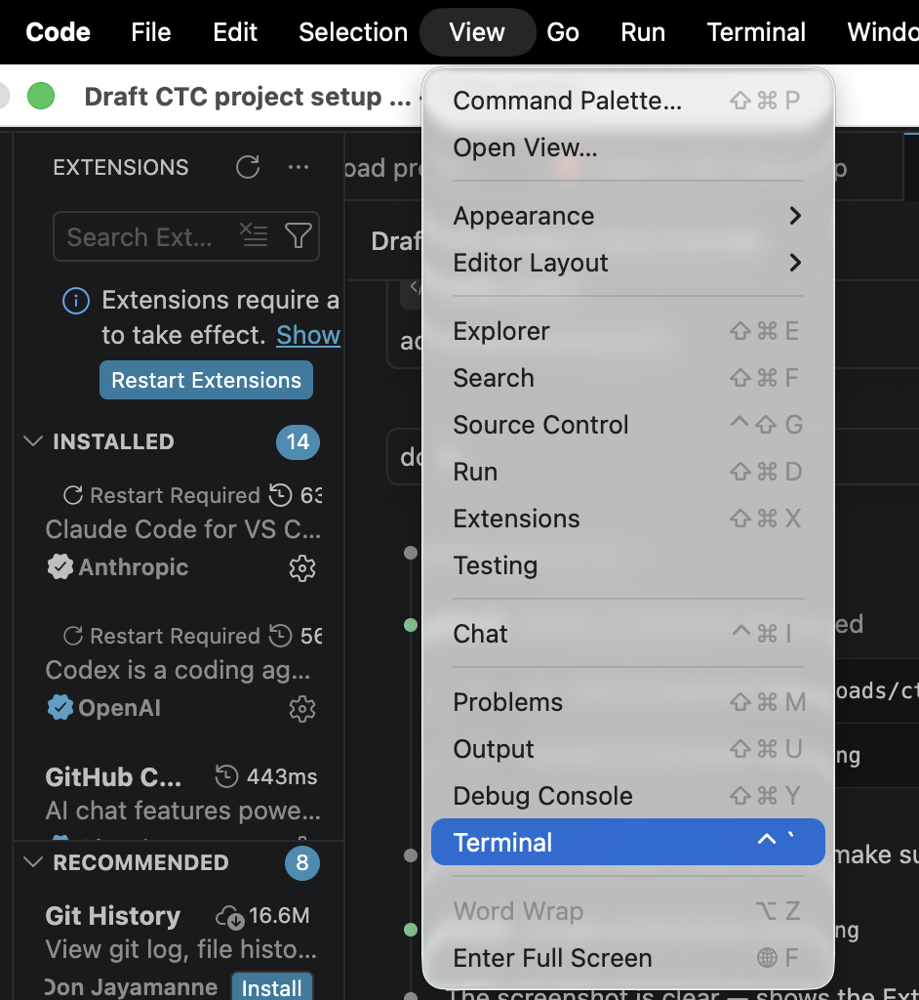
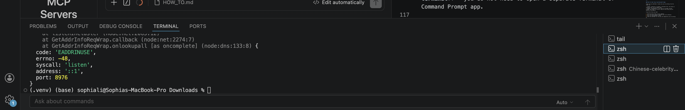
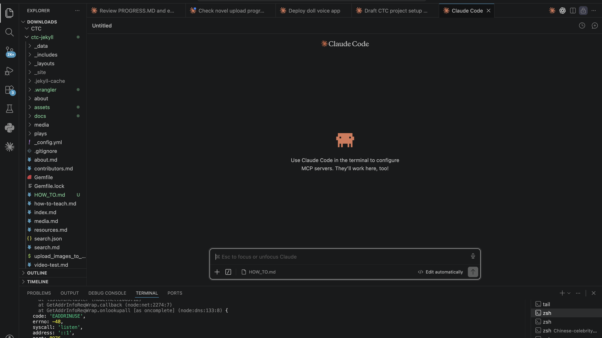

# How to Work on the CTC Website

This guide is for anyone who wants to add or edit content on the Chinese Theater Collaborative website. No coding experience needed.

It covers both **Mac** and **Windows** computers. Look for the Mac 🍎 and Windows 🪟 labels to find the instructions for your system.

---

## How This Project Is Organized

The CTC website uses four separate systems. It is important to understand what each one is for before you start.

| System | What it stores | Role |
|---|---|---|
| **Microsoft Teams** | All media files — both original source files and processed files ready for the web | Central media storage for the whole team |
| **GitHub** | Website code and text files (`.md` pages, templates, navigation) — no media | Working files — what contributors edit |
| **Cloudflare R2** | Processed, web-ready images and video clips (copied from Teams) | Distribution — files served directly to website visitors |
| **Reclaim Hosting** | The final published website visible to the public | Publication — managed by project manager only |

### Microsoft Teams folder structure

At the top level, Teams keeps documents/tools separate from media, and splits the clip media into the authored originals vs. the processed outputs:

```
Teams: CTC Project Files/
│
├── About/            ← site-level documents (About, Contribute, Organization…)
├── Accessibility/    ← the accessibility checklist and testing tools
│
├── Source/           ← the AUTHORED inputs: the docs + images + the original clips
│   ├── Plays/mulan/Mulan_1956_OperaFilm/
│   │     Mulan_1956_OperaFilm.docx              ← essay
│   │     Mulan_1956_OperaFilm_Figures.docx      ← figures (caption/Source/Credit/Alt)
│   │     Mulan_1956_OperaFilm_TransCharts.docx  ← clip translations
│   │     Mulan_1956_OperaFilm_ClipNotes.docx    ← clip notes (per-clip caption)
│   │     Mulan_1956_OperaFilm_1.jpg …           ← images
│   │     Mulan_1956_OperaFilm_Clip_1_original.mp4  ← original clip, as first sourced
│   └── Media Types/Kun Opera/  OperaType_Kun.docx, OperaType_Kun_Figures.docx, images
│
└── Processed/        ← the VIDEO-PROCESSING outputs: better clips + subtitles + audio descriptions
    └── Plays/mulan/Mulan_1956_OperaFilm/
          Mulan_1956_OperaFilm_Clip_1_2x.mp4           ← better-sourced / upscaled clip (goes to R2)
          Mulan_1956_OperaFilm_Clip_1_captions_ch.vtt  ← Chinese subtitles
          Mulan_1956_OperaFilm_Clip_1_captions_en.vtt  ← English subtitles
          Mulan_1956_OperaFilm_Clip_1_audiodesc.vtt    ← audio-description cues (+ cue_*.mp3)
```

- **Source/** — the authored materials: the module `.docx` files, the images, and the original clips as first sourced. This is what a page author downloads to build the page.
- **Processed/** — the outputs of the clip work: the re-sourced/upscaled video plus each clip's subtitle and audio-description files. The processed clip is what gets uploaded to Cloudflare R2.
- **Source/** and **Processed/** mirror each other's `Plays/…` paths, so a clip's original and its processed version sit one folder-swap apart.

> **Full spec:** naming conventions, the general-intro layout, what does *not* go on Teams, and how to migrate the current folders are in the **[Teams Folder Structure guide](TEAMS_STRUCTURE.md)**.

### The typical workflow

```
Teams/Source           →   Teams/Processed          →   Cloudflare R2   →   Reclaim Hosting
──────────────             ────────────────             ─────────────       ───────────────
docs + images +        →   re-sourced/upscaled clips →   Upload for web  →   Live website
original clips             + subtitles + audio desc.     + GitHub for
                                                          .md files
```

**Step by step:**

1. Save the authored materials — the three `.docx` files, images, and original clips — to **Teams / Source/**
2. Re-source/upscale each clip and create its subtitles and audio description; save those outputs to **Teams / Processed/**
3. Download files from Teams and write or edit the page content in `.md` files **locally on your computer**
4. Upload the processed clips (and images) from your computer to **Cloudflare R2**
5. Test your changes locally on your own computer (see Section 3)
6. Run the accessibility check using the tools in **Teams / Accessibility/** (see Section 9)
7. Push your finished `.md` files to **GitHub**
8. The project manager publishes the final site to **Reclaim Hosting**

### Keep the docs and memory current when plans change

These guides only help if they match how the project actually works. Whenever a workflow, tool, or decision changes:

- **Update the docs in the same session.** Fix the matching `HOW_TO_*.md` guide, plus [NEXT_STEPS.md](NEXT_STEPS.md) and [TEAMS_STRUCTURE.md](TEAMS_STRUCTURE.md) if they're affected. A change isn't done until its guide reflects it — otherwise the next contributor follows stale instructions.
- **Keep Claude Code's memory current.** If you use Claude Code, save durable decisions, preferences, and conventions to its memory so they carry across sessions, and update or delete a memory when a plan changes or turns out wrong — stale memory is worse than none. Memory holds the *why* and the conventions; the step-by-step *how* belongs in these `HOW_TO_*.md` files.

---

## Table of Contents

1. [What You Need to Install](#1-what-you-need-to-install)
2. [Get the Files on Your Computer](#2-get-the-files-on-your-computer)
3. [Preview the Website on Your Computer](#3-preview-the-website-on-your-computer)
4. [How the Website Is Organized](#4-how-the-website-is-organized)
5. [How to Edit an Existing Page](#5-how-to-edit-an-existing-page)
6. [How to Add a New Play](#6-how-to-add-a-new-play)
7. [How to Add an Adaptation Module](#7-how-to-add-an-adaptation-module)
8. [How to Add Another Page (About or Standalone)](#8-how-to-add-another-page-about-or-standalone)
9. [Run the Accessibility Check](#9-run-the-accessibility-check)
10. [How to Publish Your Changes](#10-how-to-publish-your-changes)
11. [Using Claude Code (AI) to Generate and Edit Content](#11-using-claude-code-ai-to-generate-and-edit-content)

> **Not sure which section you need?** See the [quick guide below](#which-section-do-i-need) — it maps each kind of page to the right section or companion guide.

### Companion Guides

Detailed guides for specific tasks. This document links to each one where it comes up, but they are all listed here so you can find them directly.

| Guide | Use it when you are… |
|---|---|
| [Media Types (Opera Styles) Pages](HOW_TO_media.md) | Adding or editing a format-level page in the Media Types section (Opera Film, Lianhuanhua, Kun Opera, …) |
| [Figure Placement and Sizing](HOW_TO_figures.md) | Deciding where an image sits on the page, or fixing empty space beside a floated figure |
| [Subtitles, Sound Labels, and Audio Descriptions](HOW_TO_subtitles_and_audio.md) | Creating the accessibility files for a video clip |
| [Clip Sourcing and Alignment](HOW_TO_clip_source_and_alignment.md) | Cutting a new clip for a page, finding a clearer source, or re-cutting one so its subtitles and audio description still line up |
| [Topaz Upscaling](HOW_TO_topaz_upscaling.md) | Improving a clip's quality when no clearer source exists |
| [Alt Text](HOW_TO_alt_text.md) | Writing the description of an image for screen readers |

---

## 1. What You Need to Install

You only need to do this once.

> **Tip: Let an AI agent do the installation for you.**
> Instead of running each command yourself, you can ask a coding AI agent like **Claude Code** to walk you through the entire setup. See the example prompts at the end of this section.

---

### Step A — Download and set up Visual Studio Code

Download **Visual Studio Code** (free, works on Mac and Windows):
https://code.visualstudio.com

VS Code is where you will write and edit all the website content. It also has a **built-in terminal** so you can run commands without opening a separate app, and a **Claude Code extension** so you can use AI assistance directly inside VS Code.

#### Install the Claude Code extension

1. Open VS Code
2. Click the **Extensions** icon in the left sidebar — or press `Ctrl+Shift+X` on Windows / `⌘+Shift+X` on Mac

   
3. Search for **Claude Code**
4. Click **Install**

Once installed, you can open Claude Code with the button in the bottom status bar or by pressing `Ctrl+Shift+P` (Windows) / `⌘+Shift+P` (Mac) and searching "Claude Code".

#### Open the built-in terminal

All commands in this guide should be typed in the **VS Code terminal** — you do not need to open a separate Terminal or Command Prompt app.

To open the terminal inside VS Code:
- Go to **View → Terminal** in the menu, or
- Press `` Ctrl+` `` (Windows) / `` ⌘+` `` (Mac)



A terminal panel will open at the bottom of VS Code. This is where you will type all commands.



**🪟 Windows only — set Git Bash as your terminal**

VS Code on Windows defaults to PowerShell, which does not work well with this project. Switch it to Git Bash:

1. First download and install **Git for Windows**: https://git-scm.com/download/win (accept all default options during installation)
2. In VS Code, press `Ctrl+Shift+P` and search **Terminal: Select Default Profile**
3. Choose **Git Bash** from the list

> A dropdown menu will appear at the top of the screen listing available terminal options — select **Git Bash**.

From now on, every time you open the terminal in VS Code it will use Git Bash.

---

### Step B — Install Ruby

Ruby is the programming language that Jekyll (the website builder) runs on.

**🍎 Mac**

First install Homebrew (a tool that installs other tools):

```
/bin/bash -c "$(curl -fsSL https://raw.githubusercontent.com/Homebrew/install/HEAD/install.sh)"
```

Then install Ruby:

```
brew install ruby
```

Then add Ruby to your path (copy and paste this whole line):

```
echo 'export PATH="/opt/homebrew/opt/ruby/bin:$PATH"' >> ~/.zshrc && source ~/.zshrc
```

**🪟 Windows**

Go to https://rubyinstaller.org/downloads/ and download the version labeled **Ruby+Devkit (recommended)**.

Run the installer. When it finishes, a black window will open and ask you to press Enter — press Enter, then wait for it to finish.

---

### Step C — Install Jekyll

This command is the same on both Mac and Windows — type it in the VS Code terminal:

```
gem install bundler jekyll
```

---

### Step D — Install Python (for subtitle and audio description scripts)

Python is needed to run the Gemini and OpenAI scripts used to generate sound labels and audio descriptions.

**🍎 Mac**
```
brew install python
```

**🪟 Windows**
Download and install Python from https://www.python.org (click "Latest Release"). During installation, check the box **"Add Python to PATH"**.

Then install the required packages (same on both systems):
```
pip install google-genai openai python-docx
```

> Use **`google-genai`** (the current Google GenAI SDK) — not the older `google-generativeai` package. The scripts import `from google import genai`, which only works with `google-genai`. `python-docx` is needed to read the TransChart `.docx` files.

**Optional — Whisper (only for transcribing clips that have no subtitle source).** Most clips get their Chinese text from a TransChart or an existing subtitle track. If you will ever need to transcribe a clip's audio from scratch, also install Whisper:

```
pip install -U openai-whisper
```

> Whisper needs **ffmpeg**, which is installed in Step F below. The first time you run it, it downloads a large model file (~3 GB), so install it only if you expect to need it. Full usage is in the [subtitles and audio guide](HOW_TO_subtitles_and_audio.md).

#### Install the Python extension in VS Code

1. Open VS Code and click the **Extensions** icon ( `⊞` ) in the left sidebar
2. Search for **Python** (published by Microsoft)
3. Click **Install**

---

### Step E — Install Wrangler (for uploading images and videos)

Wrangler is the tool used to upload media files to the cloud. First install Node.js:

**🍎 Mac**
```
brew install node
```

**🪟 Windows**
Download and install Node.js from https://nodejs.org (click the "LTS" version).

Then install Wrangler (same on both systems):

```
npm install -g wrangler
```

Then log in to Cloudflare:

```
wrangler login
```

A browser window will open — log in with the project's Cloudflare account credentials.

---

### Step F — Install the video tools (for sourcing and cutting clips)

These are needed to download a video segment from YouTube, cut it, and re-encode it for the web — see the [clip sourcing and alignment guide](HOW_TO_clip_source_and_alignment.md). You only need them if you are working with video clips.

> **On a university or work computer, check your IT policy before installing or using these.** All three are free and open-source and run locally, but some institutions require approval for any installed software. In particular, downloading from YouTube with yt-dlp may raise terms-of-service or copyright questions — confirm with the project supervisor or OSU IT that your use is cleared before relying on it.

- **yt-dlp** — downloads a segment from YouTube (or similar sites)
- **ffmpeg** — cuts, trims, and re-encodes the clip; also extracts frames and measures audio
- **deno** — a JavaScript runtime that yt-dlp needs in order to list every available resolution

**🍎 Mac**
```
brew install yt-dlp ffmpeg deno
```

**🪟 Windows**
```
winget install yt-dlp.yt-dlp Gyan.FFmpeg DenoLand.Deno
```
(Or download ffmpeg from https://ffmpeg.org/download.html and add it to your PATH.)

> **Keep yt-dlp up to date.** YouTube changes often, and an outdated yt-dlp may fail to download or silently hide the higher-resolution formats — so you could reject a source that is actually better. Update it with `brew upgrade yt-dlp` (Mac) or `winget upgrade yt-dlp.yt-dlp` (Windows).

---

### Using Claude Code to complete the installation

If you are not comfortable running commands yourself, you can use **Claude Code** — the AI assistant built into VS Code — to guide you through or complete the entire installation automatically.

#### How to open Claude Code in VS Code

1. Make sure you have installed the **Claude Code extension** (see Step A above)
2. Open the `ctc-jekyll` project folder in VS Code:
   - Go to **File → Open Folder**
   - Select the `ctc-jekyll` folder on your computer
   - Click **Open**

   > This step is important — Claude Code needs to know which project you are working on. Always open the folder before starting Claude Code.

3. Open the Claude Code panel by clicking its icon in the left sidebar, or press `Ctrl+Shift+P` (Windows) / `⌘+Shift+P` (Mac) and search **Claude Code: Open**

   

4. Type your request in the chat box and press Enter — Claude Code can read your project files and run commands in the VS Code terminal on your behalf

#### Example prompts for installation

Copy and paste any of these prompts directly into Claude Code:

---

**Check what is already installed:**
```
I am setting up the CTC Jekyll website on my [Mac / Windows] computer.
Please check whether Ruby, Bundler, Jekyll, Node.js, and Wrangler are 
already installed, and tell me what still needs to be installed.
```

---

**Run the full setup from scratch:**
```
I need to set up the CTC Jekyll website on my [Mac / Windows] computer 
from scratch. Please install the following tools in the correct order:
1. Homebrew (Mac only)
2. Ruby and Bundler
3. Jekyll
4. Python and the pip packages: google-genai openai python-docx
5. Node.js
6. Wrangler (Cloudflare CLI)
7. (Only if I will work with video clips) yt-dlp, ffmpeg, and deno

After each step, confirm it was successful before moving to the next one.
```

---

**Fix a specific error:**
```
I tried to run "bundle exec jekyll serve" and got this error:

[paste the error message here]

I am on a [Mac / Windows] computer. Please diagnose and fix the problem.
```

---

**Install only what is missing:**
```
I already have Ruby installed on my Mac but I'm getting an error when 
I run "gem install bundler jekyll". The error says:

[paste the error message here]

Please fix this and complete the Jekyll installation.
```

---

**Set up Wrangler and log in to Cloudflare:**
```
Please install Wrangler (the Cloudflare CLI tool) on my [Mac / Windows] 
computer and walk me through logging in to the CTC Cloudflare account.
```

---

## 2. Get the Files on Your Computer

There are three places where project files are stored. You need to get files from each one.

---

### Part A — Get the website code from GitHub

GitHub stores all the `.md` page files, templates, and navigation data. To download them, open the **VS Code terminal** (View → Terminal) and run:

**🍎 Mac**
```
cd ~/Documents
git clone https://github.com/CTC2026/ctc-jekyll.git
```

**🪟 Windows**
```
cd /c/Users/YourName/Documents
git clone https://github.com/CTC2026/ctc-jekyll.git
```

Replace `YourName` with your actual Windows username.

This creates a `ctc-jekyll` folder on your computer. Then enter the folder and install the required tools:

```
cd ctc-jekyll
bundle install
```

---

### Part B — Get files from Microsoft Teams

Teams has two subfolders — make sure you are working from the right one:

- **Teams / Source/** — original, untouched files. Use these as reference only. Do not modify them.
- **Teams / Processed/** — files that are already resized, trimmed, and ready for the web. These are the files you will upload to the website.

To get the files you need:

1. Open Microsoft Teams on your computer
2. Go to the **CTC project channel** and click **Files**
3. Open the **Processed/** folder
4. Find the subfolder for the play and adaptation you are working on
5. Download the images and video clips to your computer
6. Place them in the matching subfolder inside `ctc-jekyll/assets/`:

```
ctc-jekyll/assets/plays/mulan/1956-opera-film/
```

> If the files you need are not yet in **Processed/**, you will need to edit them from **Source/** first (resize images, trim video clips), then save them to **Processed/** before continuing.

> You do not need to download everything — only the files for the module you are currently working on.

---

### Part C — Cloudflare R2 holds the processed, web-ready files

**Cloudflare R2 is not where you get files from — it is where you send files to.**

Once you have downloaded source files from Teams, resized or trimmed them as needed, and are ready to put them on the website, you upload them to Cloudflare R2. From there, the website can display them to visitors.

Think of it this way:

```
Teams (originals)  →  Your computer (edit/process)  →  Cloudflare R2 (web-ready, live)
```

You do not need to log in to Cloudflare R2 to browse files. Uploading is covered in Sections 6 and 7.

> **The R2 upload is a separate, more technical step.** If you are a **content author**, your job is to prepare the finished files (processed images, upscaled clips, audio-description MP3s) — you can hand these off to whoever manages the Cloudflare account rather than uploading them yourself. The upload commands in Sections 6 and 7 are for whoever does that step; a project maintainer will typically run them.

---

## 3. Preview the Website on Your Computer

Any time you want to see how your changes look before publishing, open the **VS Code terminal** (View → Terminal), make sure you are in the `ctc-jekyll` folder, and run:

```
bundle exec jekyll serve
```

Then open your web browser and go to:

```
http://localhost:4000/ctc-jekyll/
```

You will see a live preview of the website. Every time you save a file, the preview updates automatically.

To stop the preview, press **Ctrl + C** in the VS Code terminal.

> **Tip:** Keep the preview running in one window while you edit files in Visual Studio Code. Switch to the browser to check your changes after each save.

### The two versions of the site

There are two places you can view the site — use the local one while you work, and the GitHub one to confirm what has actually been pushed:

| Version | Link | What it shows |
|---|---|---|
| **Local preview** | [http://localhost:4000/ctc-jekyll/](http://localhost:4000/ctc-jekyll/) | Your own unsaved/unpushed edits, live on your computer. Only works while `bundle exec jekyll serve` is running, and only you can see it. |
| **GitHub version** | [https://ctc2026.github.io/ctc-jekyll/](https://ctc2026.github.io/ctc-jekyll/) | The site built from what has been **pushed to GitHub** (Section 10). Anyone on the team can open it; it updates a minute or two after each push. This is *not* the final public site — that is Reclaim Hosting, published by the project manager. |

> Check your work in the **local preview** first. After you push, open the **GitHub version** to confirm the change went up and looks right.

---

## 4. How the Website Is Organized

The website files are organized like this:

```
ctc-jekyll/
│
├── plays/              ← All the play pages live here
│   ├── mulan/
│   ├── mudanting/
│   ├── xixiangji/
│   └── ...
│
├── about/              ← The "About" section pages
├── media/              ← The "Media Types" / "Opera Styles" section pages
│   ├── kun-opera.md
│   ├── lianhuanhua.md
│   └── ...             ← one page per media format (see HOW_TO_media.md)
│
├── assets/
│   ├── images/         ← Banner images and logos
│   ├── plays/          ← Images for each play (one subfolder per play)
│   └── media/          ← Images for the Media Types pages
│
├── _data/
│   ├── play_nav.yml    ← Controls the sidebar menu on play pages
│   ├── media_nav.yml   ← Controls the sidebar menu on Media Types pages
│   └── banner_alt.yml  ← Alt text for the per-play banner images
│
└── index.md            ← The homepage
```

Each page on the website is a **text file** ending in `.md`. You write the content of the page in that file.

> The `media/` pages (Media Types / Opera Styles) work almost exactly like play pages but use their own layout and sidebar. Adding or editing one is covered in its own guide — see [HOW_TO_media.md](HOW_TO_media.md).

---

## Which Section Do I Need?

The site has more than one kind of page, and each has its own workflow. Find what you are doing in the table below and go straight to the right section or companion guide.

| What you are doing | Where to go |
|---|---|
| A small change to a page that already exists (typo, link, a sentence) | Section 5 — Edit an Existing Page |
| Adding a whole **new play** (its intro page) | Section 6 — Add a New Play |
| Adding a **film, opera, TV show, comic, or recording** of a play | Section 7 — Add an Adaptation Module |
| Adding an **About-section page** or any other **standalone page** | Section 8 — Add Another Page |
| Adding a **Media Type / Opera Style** page (Opera Film, Lianhuanhua, Kun Opera, …) | [HOW_TO_media.md](HOW_TO_media.md) |

> **The underlying pattern is the same for every page.** No matter which kind you are adding, a page is always a `.md` text file: you create the file, copy the frontmatter from an existing page of the same kind, fill the body — **usually converted from a Word document** (see [Starting From a Word Document](#starting-from-a-word-document-the-usual-case) below) — add it to the right menu, preview locally (Section 3), and publish (Section 10). The sections below are just that same pattern with the specifics filled in for each page type — so if your page does not fit neatly into one, follow the closest section and adapt it.

---

## Starting From a Word Document (the Usual Case)

Most new pages are **not typed from scratch in the editor.** The contributor has already written the content in a **Word document** (`.docx`) — with its citations, italics, headings, and paragraph structure — and your job is to turn that document into a web page **without retyping it and without losing any of that formatting.**

The reliable way to do this is to let **Claude Code read the Word file directly** and convert it into a Markdown page. Do **not** just copy-paste from Word: a plain paste drops the italics, the citation formatting, and the line breaks. Instead you give Claude Code the path to the `.docx` file plus the frontmatter for the page type you are adding, and it produces the `.md` file for you.

### The general conversion prompt

Every page type uses a version of this. Fill in the file path, the target page path, and the frontmatter block from the section for your page type (linked below).

```
I have a Word document at [full path to the .docx file].

Please create a new page at [target path, e.g. plays/orphan-of-zhao/index.md].

Use this frontmatter:
[paste the frontmatter block for this page type — see the section below]

Fill the page body from the Word document. Preserve the document's
formatting exactly:
- Keep every inline citation as written, e.g. (Sieber 2022) or (Li 2022, 133).
- Keep italics on every occurrence — work titles (*The Peony Pavilion*) and
  romanized/pinyin terms (*zaju*, *huangmei*, *qingyi*). If a term is italic
  once in the source, it stays italic every time it appears.
- Keep bold, the original paragraph breaks, and any verse/quotation line
  breaks (end each blockquote line with two trailing spaces).
- Wrap all Chinese characters in <span lang="zh">…</span>.
- Do not reword, summarize, or drop anything — with one exception: if the
  source has an obvious grammar or spelling mistake (a genuine error, not
  an unusual but deliberate style choice), fix it rather than reproduce it.
```

### Which frontmatter and extra steps to use

The prompt above creates the text. For the **frontmatter** to paste in, and for the extra steps that page type needs (images, sidebar, links), go to:

- **Play intro page** → Section 6
- **Adaptation module** (a film, opera, TV show, comic, or recording) → Section 7
- **About-section or standalone page** → Section 8
- **Media Type / Opera Style page** → [HOW_TO_media.md](HOW_TO_media.md)

> **Pages with figures have a second source document.** The essay doc holds the text; a separate **figures document** (`..._Figures.docx`) holds each image's caption, Source, Credit, and **alt text**, and the essay marks where each figure goes with the image's base name. Building figures from it is covered in Section 7, Step 5.

> **Why "preserve, don't rewrite" matters.** These pages are scholarly writing. A dropped citation, or a title that loses its italics, is an **error, not a style choice** — the `.md` must match the Word document, even where the document differs from how other pages happen to read. The only things you deliberately change: wrap Chinese in `<span lang="zh">…</span>`, and fix any obvious grammar or spelling error in the source rather than reproduce it. (An image's caption — description plus any Source and Credit line — is kept exactly as written; it just goes inside an HTML `<figcaption>`, which is standard figure formatting, not a change to the text.) When Claude Code finishes, open the Word document next to the new page and skim it for any citation or italic that got lost.
>
> **A short page with no Word document** (a brief note, a simple standalone page) can still be written directly in Markdown — start from the frontmatter in the relevant section and type the content.

---

## 5. How to Edit an Existing Page

Use this section for **small changes** to pages that already exist — fixing a typo, updating a link, or adding a sentence. For adding new pages, see Sections 6, 7, and 8.

1. Open VS Code and open the `ctc-jekyll` folder: **File → Open Folder**
2. In the left panel, find the `.md` file you want to edit (for example: `plays/mulan/index.md`)
3. Edit the text **below** the second `---` line — do not touch anything between the two `---` lines at the top
4. Save the file (**Ctrl + S** on Windows, **⌘ S** on Mac)
5. Check the preview in your browser (`http://localhost:4000/ctc-jekyll/`)

For larger edits, use Claude Code instead:

```
Please update the General Background section of plays/mulan/index.md 
with the following revised text:

[paste your new text here]

Keep the frontmatter and Works Consulted section unchanged.
```

---

## 6. How to Add a New Play

This section covers the full workflow for adding a brand new play to the website — from your Word document on Teams to a live page.

---

### Step 1 — Prepare your Word document on Teams

Write your play introduction in a Word document and save it to:

```
Teams: CTC Project Files / Processed / [play-name] / [play-name]_intro.docx
```

Also save your banner image to:

```
Teams: CTC Project Files / Processed / [play-name] / [PlayName]_ResourceBanner.png
```

---

### Step 2 — Download files to your computer

Download from Teams to your computer:
- The Word document
- The banner image — place it in `ctc-jekyll/assets/images/`

---

### Step 3 — Use Claude Code to create the play page

Open VS Code, open the `ctc-jekyll` folder, and open Claude Code. Then paste this prompt:

```
I have a Word document at [file path to your .docx file].

Please create a new play intro page for a play called "[Full English Title]" 
(Chinese title: [中文標題]). The play slug is [play-slug] 
(e.g. orphan-of-zhao — lowercase, hyphens, no spaces).

1. Create the folder plays/[play-slug]/
2. Create plays/[play-slug]/index.md using the text from the Word document,
   with this frontmatter:
   - layout: play
   - play_id: [play-slug]
   - play_title: "[Full English Title]"
   - banner_image: /assets/images/[PlayName]_ResourceBanner.png
3. Add a Contents section with placeholder links for adaptations
4. Add a General Background section from the Word document text
5. Wrap all Chinese characters in <span lang="zh">...</span> tags
6. Add a Works Consulted section if the document contains references
7. Add the author credit at the bottom
8. Preserve the Word document's formatting exactly: keep every inline
   citation, all italics (work titles and romanized/pinyin terms), bold
   text, the original paragraph divisions, and any verse or quotation
   line breaks. Do not reword, summarize, or drop anything. One exception:
   if the source has an obvious grammar or spelling mistake, fix it rather
   than reproduce it.
```

> **Important — keep the original formatting.** The `.md` file must reproduce the Word document faithfully, not just its words. Carry over:
> - **Inline citations** exactly as written, e.g. `(Sieber 2022)` or `(Li 2022, 133)`.
> - **Italics** on every occurrence — work titles (`*The Peony Pavilion*`) and romanized/pinyin terms (`*zaju*`, `*huangmei*`, `*qingyi*`). If a term is italic once in the source, it should be italic *every* time it appears.
> - **Bold** text, **paragraph breaks**, and **verse/quotation line breaks** (in a Markdown blockquote, end each line with two trailing spaces so the line break shows).
> - Match the source even where it differs from other pages' house style.
>
> The only things *not* copied verbatim: wrap Chinese characters in `<span lang="zh">…</span>`, and fix any obvious grammar or spelling error in the source rather than reproduce it. (Each image's caption — its description plus any Source and Credit line — is kept exactly as written; it just goes inside an HTML `<figcaption>`, which is standard figure formatting, not a change to the text.) When Claude Code finishes, open the Word document next to the page and skim for any citation or italic that got dropped.

---

### Step 4 — Upload the banner image to Cloudflare R2

> **Content authors can hand this off.** Uploading to R2 is the separate technical step — if you are a content author, pass your finished banner image to whoever manages the Cloudflare account instead of running this yourself. The command below is for whoever does the upload.

In the VS Code terminal, run:

**🍎 Mac**
```
cd ~/Documents/ctc-jekyll
bash upload_images_to_r2.sh
```

**🪟 Windows**
```
cd /c/Users/YourName/Documents/ctc-jekyll
bash upload_images_to_r2.sh
```

---

### Step 5 — Add the play to the sidebar menu

Ask Claude Code:

```
In _data/play_nav.yml, add a new entry for [play-slug] at the bottom:
- An "Intro" item linking to /plays/[play-slug]/

Leave space to add adaptation links later.
```

---

### Step 6 — Link from the Resources page

Ask Claude Code:

```
In resources.md, add a link to the new [play title] play at /plays/[play-slug]/,
following the same format as the other plays on the page.
```

---

### Step 7 — Preview and check

Open your browser at `http://localhost:4000/ctc-jekyll/` and check:
- The play appears on the Resources page
- The intro page displays correctly with the banner image
- The sidebar shows the correct navigation

---

## 7. How to Add an Adaptation Module

An adaptation module is a page about one specific film, opera, TV show, comic, or recording of a play. This section covers the full workflow from Word document to live page, including images and video clips.

---

### Step 1 — Prepare your files on Teams

Save everything for the module — **the Word documents plus the media** — together in one folder on Teams. Name every file from the same base, `[PlayName]_[Year]_[Type]` (e.g. `Mulan_1956_OperaFilm`):

```
Teams: CTC Project Files / Source / Plays / [play-slug] / [PlayName]_[Year]_[Type] /
    [PlayName]_[Year]_[Type].docx            ← the essay (module prose)
    [PlayName]_[Year]_[Type]_Figures.docx    ← figures list: each figure's caption, Source, Credit, Alt text
    [PlayName]_[Year]_[Type]_TransCharts.docx ← clip translations: one Chinese/English table per clip
    [PlayName]_[Year]_[Type]_ClipNotes.docx  ← clip notes: per-clip caption (description, Source, Credit)
    [PlayName]_[Year]_[Type]_1.jpg           ← images (numbered)
    [PlayName]_[Year]_[Type]_Clip_1_original.mp4  ← the clip as first sourced (numbered)
```

The docs, images, and original clips are the **Source** side. When each clip is later re-sourced/upscaled and given subtitles and an audio description, those outputs go in the mirror path under `Processed/Plays/[play-slug]/[PlayName]_[Year]_[Type]/`. See the [Teams Folder Structure guide](TEAMS_STRUCTURE.md) for the full layout and naming rules.

The **`.docx` files always travel together** in the module folder: the essay supplies the prose, `_Figures.docx` supplies the images and their captions/alt text (Step 5), `_TransCharts.docx` supplies the clip subtitles and translation-notes tables ([subtitles guide](HOW_TO_subtitles_and_audio.md), Part 0), and `_ClipNotes.docx` supplies the caption under each clip (the subtitles guide, "The clip note"). A module with no video clips omits the `_TransCharts` and `_ClipNotes` docs; one with no images omits the `_Figures` doc.

---

### Step 2 — Download files to your computer

Download from Teams to your computer:
- All the Word documents: the essay, the figures document (`..._Figures.docx`), and — if the module has clips — the translation charts (`..._TransCharts.docx`) and the clip-notes doc (`..._ClipNotes.docx`)
- All image files — place them in `ctc-jekyll/assets/plays/[play-name]/[year]-[type]/`
- All video clip files — place them in the same folder

---

### Step 3 — Use Claude Code to create the module page

Open VS Code, open the `ctc-jekyll` folder, and open Claude Code. Paste this prompt:

```
I have a Word document at [file path to your .docx file].

Please create a new adaptation module page at:
plays/[play-slug]/[year]-[type].md
(e.g. plays/mulan/1956-opera-film.md)

Use this frontmatter:
- layout: play
- play_id: [play-slug]
- play_title: "[Full English Title of the Play]"
- banner_image: /assets/images/[PlayName]_ResourceBanner.png

Include:
- A "Links to the Film" section with any YouTube or external links from the document
- A module-info box with the film details (title, year, director, language, duration)
- An Introduction section
- Theme sections based on the headings in the document
- A Works Consulted section
- The author credit at the bottom

Do not add images or videos yet — just the text content. Where the module
document marks a figure with an image's base name on its own line (e.g.
Mulan_1956_OperaFilm_1), keep it as a visible placeholder so I can see where
each figure goes — the images themselves are added in Step 5.
Wrap all Chinese characters in <span lang="zh">...</span> tags.

Preserve the Word document's formatting exactly: keep every inline
citation, all italics (work titles and romanized/pinyin terms such as
zaju, huangmei, qingyi), bold text, the original paragraph divisions,
and any verse or quotation line breaks. Do not reword or omit anything —
except that if the source has an obvious grammar or spelling mistake, fix
it rather than reproduce it.
```

> **Important — keep the original formatting.** As with a play page, the module `.md` must faithfully reproduce the Word document: every inline citation, italics on each occurrence of titles and romanized terms, bold, paragraph breaks, and verse/quotation line breaks (end each blockquote line with two trailing spaces). Match the source even where it differs from other pages. Only exceptions: wrap Chinese in `<span lang="zh">…</span>`, and fix any obvious grammar or spelling error in the source rather than reproduce it. (Each image's caption — its description plus any Source and Credit line — is kept exactly as written; it just goes inside an HTML `<figcaption>`.) Afterward, compare the page against the Word document and confirm no citation or italic was lost.

---

### Step 4 — Upload images to Cloudflare R2

> **Content authors can hand this off.** Uploading to R2 is the separate technical step — if you are a content author, pass your finished, processed images to whoever manages the Cloudflare account instead of running this yourself. The command below is for whoever does the upload.

In the VS Code terminal, run:

**🍎 Mac**
```
cd ~/Documents/ctc-jekyll
bash upload_images_to_r2.sh
```

**🪟 Windows**
```
cd /c/Users/YourName/Documents/ctc-jekyll
bash upload_images_to_r2.sh
```

---

### Step 5 — Ask Claude Code to add images to the page

**The captions and alt text come from the figures document — do not write them by hand.** Each figure's caption, Source, Credit, and alt text live in the `..._Figures.docx` you downloaded in Step 2. A figure entry in that document looks like this:

```
Fig. 1: Panel 23, Du Liniang eyes the reader.
Source: Liu Changhua … Jiangsu Fine Arts Press, 1986.
Credit: Scan by CTC Project Team …
Alt: A woman in Ming-dynasty robes turns to gaze directly out at the reader.
```

- **The caption** — the `Fig. N:` line together with its Source and Credit — goes into the `<figcaption>` **exactly as written** (see the [Source/Credit note in Section 6](#6-how-to-add-a-new-play): this text is preserved verbatim, only wrapped in `<figcaption>`).
- **The `Alt:` line** becomes the image's `alt` attribute. If a figure has **no** `Alt:` line, write one using the [alt text guide](HOW_TO_alt_text.md) (under 120 characters, name the characters shown, do not repeat the caption).
- **Placement** — the essay Word document is **text only**; it does not lay out images. So placement follows two rules:
  - **The first figure** (almost always the film **poster**, Fig. 1) floats **right, beside the Information box**: put the `<figure class="module-figure-right">` **just before** the `<div class="module-info">` block. See the [figure layout guide](HOW_TO_figures.md).
  - **Every other figure** goes next to the paragraph that discusses it — where the essay names it (e.g. "(Fig. 2)") or describes that still/scene — floated right or left (alternating down the page) or centered full-width per the [figure layout guide](HOW_TO_figures.md).

Give Claude Code both the R2 confirmation and the figures document:

```
The images for plays/mulan/1956-opera-film.md have been uploaded to
Cloudflare R2. Their captions, Source, Credit, and alt text are in the
figures document at [path to ..._Figures.docx].

For each figure:
- Place the FIRST figure (the poster, Fig. 1) as <figure
  class="module-figure-right"> immediately BEFORE the <div
  class="module-info"> box, so it floats right beside the Information
  section.
- Place every other figure next to the paragraph that discusses it (where
  the essay names it, e.g. "(Fig. 2)", or describes that still), floated
  right/left or full-width per the figure layout guide.
- Put the "Fig. N" caption, Source, and Credit into the <figcaption>,
  exactly as written in the figures document.
- Use the figure's "Alt:" line as the image alt text. If a figure has no
  Alt: line, stop and tell me so I can supply one — do not invent alt text.

The R2 base URL is:
https://pub-41c640610b8146e0a2c6dc8915ac1f9d.r2.dev/assets/plays/mulan/1956-opera-film/
```

> **No separate figures document?** For an older module, or a page with just one or two images, you can instead give Claude the caption, Source, Credit, and alt text for each image directly in the prompt — but a `..._Figures.docx` with an `Alt:` line per figure is the standard going forward. See the [figure layout guide](HOW_TO_figures.md) for float-right vs. full-width placement.

---

### Step 6 — Upload video clips to Cloudflare R2

#### 6a — Get the processed video

Place the `_4k` video file in `ctc-jekyll/assets/plays/[play-name]/[year]-[type]/` on your computer:

- **If you processed the video yourself** — copy it directly from wherever you saved it locally.
- **If someone else processed it** — download it from **Teams / Processed / [play-name] / [year]-[type] /** (Teams is used as shared backup storage between contributors).

> Video files processed with Topaz carry a suffix showing how they were upscaled — usually `_2x` (2x output, the common case), or `_4k` when a Film 4K preset was used (e.g. `Feiyimeng_1964_OperaFilm_Clip_4_2x.mp4`). Always use the upscaled version, not the original source file. See the [Topaz upscaling guide](HOW_TO_topaz_upscaling.md) for which suffix goes with which preset.

> **Before upscaling a clip, always look for a clearer source first.** Search for a higher-quality version of the same scene (a better YouTube/Bilibili upload, an official restoration, a Blu-ray/DVD rip); a genuinely higher-resolution source beats an upscaled low-resolution one. Only upscale when no clearer source exists. See the [Topaz upscaling guide](HOW_TO_topaz_upscaling.md) for details.

> **A resolution number can lie.** A clip stored as `1920x1080` may be an upscale of a low-resolution source: high pixel count, no real detail. Judge a source by looking at it, not by its label. The [clip sourcing and alignment guide](HOW_TO_clip_source_and_alignment.md) covers how to check what a source really offers, and how to re-cut a clip so its existing subtitles and audio description still line up.

#### 6b — Upload to R2

> **Content authors can hand this off.** Getting the clip ready (steps 6a above — sourcing, upscaling, subtitles, audio description) is the author's work. The upload itself is the separate technical step — if you are a content author, pass your finished video and audio-description files to whoever manages the Cloudflare account instead of running the commands below yourself.

**Preferred: ask Claude Code to do the upload for you**

Open Claude Code in VS Code and paste a prompt like this:

```
Please upload the following video clip to Cloudflare R2:

File: assets/plays/mulan/1956-opera-film/Mulan_1956_Clip_1_4k.mp4
R2 path: ctc-media/assets/plays/mulan/1956-opera-film/Mulan_1956_Clip_1_4k.mp4

Use wrangler with --content-type video/mp4 --remote. I am in the ctc-jekyll folder.
```

Adjust the file name, play name, and folder path for your clip. Claude Code will run the wrangler command for you and confirm when the upload is done.

---

**Or run the command yourself** in the VS Code terminal:

**🍎 Mac**
```
cd ~/Documents/ctc-jekyll
wrangler r2 object put ctc-media/assets/plays/mulan/1956-opera-film/Mulan_1956_Clip_1_4k.mp4 \
  --file assets/plays/mulan/1956-opera-film/Mulan_1956_Clip_1_4k.mp4 \
  --content-type video/mp4 \
  --remote
```

**🪟 Windows**
```
cd /c/Users/YourName/Documents/ctc-jekyll
wrangler r2 object put ctc-media/assets/plays/mulan/1956-opera-film/Mulan_1956_Clip_1_4k.mp4 \
  --file assets/plays/mulan/1956-opera-film/Mulan_1956_Clip_1_4k.mp4 \
  --content-type video/mp4 \
  --remote
```

> **Important:** Always include `--remote` in the wrangler command. Without it, wrangler uploads to a local simulator on your computer instead of the real Cloudflare R2 bucket, and the file will not appear on the website.

Repeat for each clip, replacing the filename each time.

---

### Step 7 — Ask Claude Code to add video clips to the page

**Where clips go.** The essay Word document is text only and does not mark clip positions — clips are organized by the page's own **Theme** section, not by the prose. Each clip is one scene: it gets its own `###` sub-heading with the scene name and the **timecode range** it covers (e.g. `### Path on the Outskirts (26:40–29:08)`), a short paragraph of context, and then the clip embed. Put the clips in the order the scenes occur in the film. A single framing clip (a trailer, a cover-song performance) can instead sit inside the **Introduction**.

Tell Claude which scene each clip belongs to and where in the film it falls:

```
The following video clips for plays/mulan/1956-opera-film.md have been 
uploaded to Cloudflare R2. Add each under the Theme section as its own
scene sub-heading (### Scene name (timecodes)), in film order:

- Mulan_1956_Clip_1.mp4 — scene "Mulan tries on her father's armor" (29:43–31:40)
- Mulan_1956_Clip_2.mp4 — scene "Mulan returns home" (1:22:10–1:24:05)

Use the standard clip-section embed (video + subtitle buttons + clip
caption) from the subtitles guide.

The R2 base URL is:
https://pub-41c640610b8146e0a2c6dc8915ac1f9d.r2.dev/assets/plays/mulan/1956-opera-film/
```

> **The clip embed and the translation-notes table are documented in the [subtitles & audio guide](HOW_TO_subtitles_and_audio.md).** That guide has the exact `<div class="clip-section">` markup (video, subtitle-language buttons, `clip-caption`) and the `<details class="translation" markdown="1">` block. The `clip-caption` is the **clip note** — a hand-written caption under each clip (`Clip N: description. Source: … Credit: …`); its template and where the text comes from are in that guide. **Each clip that has dialogue gets its own translation-notes table directly below its clip** — a collapsible two-column table (`Chinese Captions | CTC Translation`) whose text comes from that clip's verified subtitles/TransChart, not from the essay. A clip with no dialogue (a montage or a purely musical number) has no translation-notes table.

> **The TransChart is where those clip translations live.** It is a **separate, standalone Word document — one per module** (e.g. `Feiyimeng_1964_OperaFilm_TransCharts.docx`), holding a two-column Chinese/English table for each clip. Save it with the module's other **source materials** (not in the git repo — `.docx` files are gitignored); the subtitle and translation-notes files are generated from it. How to write one, and its exact table layout, is in **Part 0 of the [subtitles & audio guide](HOW_TO_subtitles_and_audio.md)**.

---

### Note — Lazy loading and video preloading are automatic

You do not need to add any special attributes to your images or video clips. The website automatically handles this for every page:

- **Images** in the page body are lazy-loaded — they only download when the visitor scrolls near them, which keeps the page fast even with many images.
- **Videos** are set to preload only metadata (duration and thumbnail) — the video stream itself does not download until the visitor presses play.
- **Banner images and the site logo** are excluded from lazy loading because they are visible immediately when the page opens.

This behavior is built into the site-wide JavaScript and applies to every new page you create without any extra steps. The only exception: if you add an image *outside* the standard page banner — meaning an image that appears at the very top of the page, visible immediately before scrolling, but not placed inside the `.page-banner` section that all play pages use — add `loading="eager"` to that image tag so it loads immediately. In practice this is unlikely to come up, since every play page uses the same banner layout and that banner image already loads eagerly by default.

**Links are underlined automatically, too.** For accessibility (WCAG 1.4.1, so color is not the only thing marking a link), every inline text link in the page body, in figcaptions, and in Works Consulted lists is underlined by the site-wide CSS. You do **not** add any underline styling yourself — just write ordinary links (`<a href="…">…</a>` or Markdown `[text](url)`) and the site handles the rest.

---

### Step 8 — Add the module to the sidebar menu

Ask Claude Code:

```
In _data/play_nav.yml, under the "mulan" section, add a new item:
- Title: "Hua Mulan (1956)"
- URL: /plays/mulan/1956-opera-film/

Place it after the existing last entry under mulan.
```

---

### Step 9 — Preview and check

Open your browser at `http://localhost:4000/ctc-jekyll/` and check:
- The new page appears in the sidebar
- Images display correctly
- Video clips play
- Text formatting looks right

---

## 8. How to Add Another Page (About or Standalone)

Not every new page is a play, a module, or a media type. You may need to add a page to the **About** section (Project Team, Organization, Permissions, and so on) or a general **standalone** page that stands on its own (like the Resources page). These use the same "create a `.md` file" pattern as everything else — only the layout, the URL, and how you link to the page differ.

First decide which kind you are adding:

| Kind | Layout | Lives in | Example |
|---|---|---|---|
| **About-section page** — part of the About area, shares the About sidebar | `about` | `about/[slug].md` | `about/permissions.md` |
| **Standalone page** — its own page, no shared sidebar | `page` | root of the project, `[slug].md` | `resources.md` |

---

### Step 1 — Create the page file

Copy the frontmatter from an existing page **of the same kind** and change the details. The easiest way is to open a sibling page (for an About page, open any file in `about/`; for a standalone page, open `resources.md`) and use its top block as a template.

If the page content comes from a Word document, use the conversion prompt in [Starting From a Word Document](#starting-from-a-word-document-the-usual-case) together with the frontmatter shown below — do not retype the text by hand.

**An About-section page** — create `about/[slug].md` with:

```yaml
---
layout: about
title: Your Page Title
permalink: /about/[slug]/
---
```

**A standalone page** — create `[slug].md` in the project root with:

```yaml
---
layout: page
title: Your Page Title
permalink: /[slug]/
---
```

Below the second `---`, write the page content in Markdown, exactly as for any other page. Wrap all Chinese characters in `<span lang="zh">…</span>`, and if you add figures use the standard figure classes — see the [figure layout guide](HOW_TO_figures.md) and the [alt text guide](HOW_TO_alt_text.md).

> **Using Claude Code:** paste a prompt like —
> *"Create a new About-section page at `about/permissions.md` titled 'Permissions'. Use `layout: about` and `permalink: /about/permissions/`. Here is the text: [paste]. Wrap Chinese in `<span lang=\"zh\">` and keep every citation, italic, and paragraph break from the source."*

---

### Step 2 — Add the page to its menu

This step is different from plays and media, because the About sidebar is **not** driven by a `_data/*.yml` file.

- **About-section page** — the sidebar links are written directly in the layout file `_layouts/about.html`. To make your new page appear in the About sidebar, add a link to that list. Because it is HTML, the simplest way is to ask Claude Code:

  ```
  In _layouts/about.html, add a new item to the About sidebar list:
  a link to /about/[slug]/ with the label "Your Page Title",
  placed after the "Permissions" entry. Follow the exact same format
  as the existing <li> items, including the sidebar-active / aria-current
  highlighting logic.
  ```

- **Standalone page** — there is no shared sidebar to update. Instead, add a link to it from wherever it should be reachable — for example a card on the Resources page, or an existing navigation menu. Ask Claude Code:

  ```
  Add a link to my new page at /[slug]/ from [where it should appear,
  e.g. "the Resources page card grid"], following the same format as the
  other links there.
  ```

---

### Step 3 — Images (if any)

If your page includes images, upload them to Cloudflare R2 the same way as any other image (see Section 7, Step 4), and give every image a meaningful `alt` text — see the [alt text guide](HOW_TO_alt_text.md).

---

### Step 4 — Preview and check

Open your browser at `http://localhost:4000/ctc-jekyll/` and check:
- The page loads at its URL (`/about/[slug]/` or `/[slug]/`)
- For an About page: it appears in the About sidebar and its own entry is highlighted
- For a standalone page: the link you added reaches it
- Chinese text renders correctly and any citations and italics carried over from your source

Then publish following Section 10.

---

## 9. Run the Accessibility Check

Before publishing, check that your new page meets accessibility standards. This ensures the site is usable by people with visual impairments or who use screen readers.

The accessibility tools and checklist for this project are stored in **Microsoft Teams**:

1. Open Microsoft Teams and go to the **CTC project channel**
2. Click **Files** and open the **Accessibility/** folder
3. Follow the instructions in that folder to run the check on your new or edited page
4. Fix any issues flagged before moving on to publishing

Common things the check looks for:
- Every image has a descriptive `alt` text (not just left blank)
- `alt` text is **under 120 characters** — a brief visual summary; do not repeat the `<figcaption>`; see `docs/HOW_TO_alt_text.md` for full guidelines
- Headings follow a logical order (`##` before `###`, no skipped levels)
- Links have meaningful text (not "click here")
- Videos have captions (`.vtt` subtitle files attached)
- Text has sufficient color contrast

---

## 10. How to Publish Your Changes

Publishing happens in two stages: you push your files to GitHub, then the project manager deploys to the live site on Reclaim Hosting.

---

### Stage 1 — Push your changes to GitHub (all contributors)

Open the **VS Code terminal** (View → Terminal), make sure you are in the `ctc-jekyll` folder, and run these three commands:

```
git add .
git commit -m "Brief description of what you changed"
git push
```

Write something meaningful in the quotes — this is a note to yourself and your collaborators.

Examples:
- `"Add 1956 Mulan opera film module"`
- `"Fix typo in Xixiangji intro"`
- `"Add images for Mudanting 1986 comic"`

> **Note:** The first time you run `git push` on a new computer, GitHub may ask for your username and password. Use the GitHub account that has access to the CTC2026 organization.

---

### Stage 2 — Deploy to the live site (project manager only)

After your changes are pushed to GitHub, notify the project manager. They will deploy the updated site to **Reclaim Hosting**, where the final public website lives.

The live website is at: [your Reclaim Hosting URL]

> Contributors do not have direct access to Reclaim Hosting. Once you have pushed to GitHub, your job is done — let the project manager know so they can publish.

---

## 11. Using Claude Code (AI) to Generate and Edit Content

**Claude Code** is an AI assistant made by Anthropic that can read your project files and write or edit code for you. Instead of writing the website code by hand, you can describe what you want in plain English and Claude Code will do it.

This is especially useful if you are not comfortable with HTML or Markdown formatting.

---

### How to Open Claude Code

Claude Code runs inside VS Code. If you have not set it up yet, follow the instructions in **Section 1, Step A** — it covers installing the extension, opening the `ctc-jekyll` folder, and launching the Claude Code panel.

Once Claude Code is open, type your request in the chat box and press Enter.

---

### How to Write a Good Prompt

A good prompt tells Claude Code:
1. **What file** you want to change (or create)
2. **What content** you want to add
3. **Any specific formatting** you need

You do not need to know any code. Just describe what you want.

---

### Example Prompts for Additional Tasks

These prompts cover tasks not already described in Sections 6, 7, and 8.

---

**Check and fix formatting on an existing page**

```
Read the file plays/pipaji/2012-recorded-perf.md and tell me if anything 
looks wrong with the formatting — headings, image tags, Chinese text 
markup, or Works Consulted structure. Then fix any issues you find.
```

---

**Add a nested sub-play to the sidebar menu** (e.g. Guan Hanqing style with children)

```
In _data/play_nav.yml, under the "guan-hanqing" section, add a new 
parent item "New Work: Intro" linking to /plays/guan-hanqing/newwork/,
with two children:
- "Version A (1960)" linking to /plays/guan-hanqing/newwork-1960-opera-film/
- "Version B (1985)" linking to /plays/guan-hanqing/newwork-1985-recorded-perf/
```

---

**Add a subtitle file to a video clip**

```
In plays/mulan/1956-opera-film.md, find the video clip for 
Mulan_1956_Clip_1.mp4 and add a subtitle track using the file 
assets/subtitles/Mulan_1956_Clip_1.vtt with label "English".
```

---

**Translate or reformat a bibliography**

```
Format the following bibliography entries as a Works Consulted section 
for the bottom of plays/mudanting/1986-opera-film.md:

[paste your references here]

Use the standard collapsible Works Consulted format used elsewhere on the site.
```

---

**Check all image alt texts on a page**

```
Read plays/xixiangji/1965-opera-film.md and check that every image has 
a meaningful alt text (not blank, not just the filename). List any that 
need updating and suggest better alt text for each.
```

---

### After Claude Code Makes Changes

1. **Check the preview** — go to your browser at `http://localhost:4000/ctc-jekyll/` to see how it looks (Jekyll must be running — see Section 3)
2. **Read the changes** — Claude Code will show you exactly what it changed; review it before publishing
3. **Ask for corrections** — if something looks wrong, just describe the problem in plain English and it will fix it
4. **Publish when ready** — follow Section 10 to publish your changes

---

### Tips for Better Results

- **Be specific** about file names and locations — say `plays/mulan/1956-opera-film.md` rather than "the Mulan page"
- **Give it examples** — say "use the same format as plays/mulan/1939-film.md"
- **One task at a time** — break big tasks into smaller steps
- **Paste your content** — you can paste raw research notes, bibliographies, or translated text directly into the prompt and ask Claude to format it correctly for the website

---

## Need Help?

Contact the project manager if you get stuck at any step.
