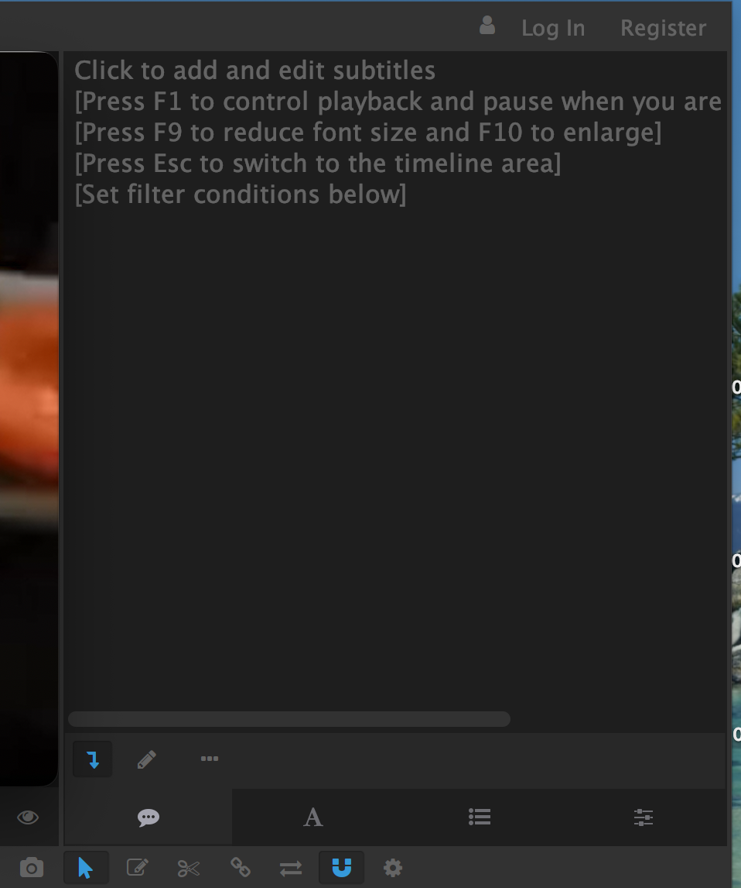
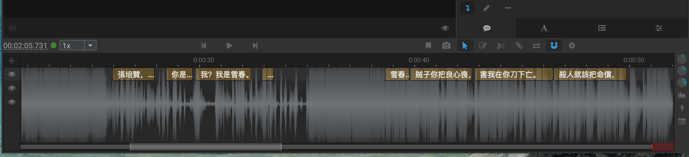
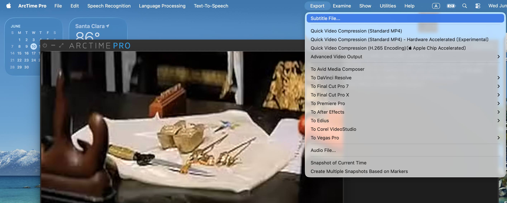

# How to Make Subtitles, Sound Labels, and Audio Descriptions

This guide explains the full workflow for creating accessibility files for video clips on the CTC website.

---

## Overview: Three Types of Accessibility Files

| Type | What it does | Tool used |
|---|---|---|
| **Subtitles** | Displays spoken words as on-screen text | Arctime (for timestamping) |
| **Sound labels** | Labels significant non-speech sounds (music, applause) | Gemini API or manual editing |
| **Audio descriptions** | Describes what is happening visually, read aloud for blind viewers | Gemini API (text) + OpenAI API (audio) |

---

## Workflow at a Glance

After the Chinese VTT is exported from Arctime, all remaining steps are handled by Claude Code. Work through them in order:

1. **Arctime** → export `[ClipName]_ch.vtt` to the clip subfolder
2. **Claude Code** → generate `[ClipName]_en.vtt` from the TransChart
3. Review and edit both VTT files in VS Code
4. **Claude Code** → generate `[ClipName]_soundlabels.vtt` and merge into `_captions_ch.vtt` / `_captions_en.vtt`
5. **Claude Code** → generate `[ClipName]_audiodesc.vtt`
6. Review and edit the audio description file
7. **Claude Code** → generate `cue_*.mp3` audio files and upload to Cloudflare R2
8. **Claude Code** → add subtitle and audio description tracks to the play page

All VTT files live in:
```
assets/subtitles/[play-name]/[year]-[type]/clip_[N]/
```

---

## Before You Start — Install Required Tools

You only need to do this once.

### Install Arctime Pro

Download and install Arctime Pro from https://arctime.org

For a quick introduction to the interface, see the [Arctime Quick Start Guide](https://arctime.org/quick-start-guide.html).

### Install Python packages for Gemini and OpenAI APIs

Open the VS Code terminal and run:

**🍎 Mac**
```
pip3 install google-genai openai python-docx
```

**🪟 Windows**
```
pip install google-genai openai python-docx
```

### Get your API keys

You need two API keys — one for Gemini (Google) and one for OpenAI. Do this once and save the keys somewhere safe.

**Gemini API key**

1. Go to https://aistudio.google.com
2. Sign in with your Google account
3. Click **Get API key** → **Create API key**
4. Copy the key and save it somewhere safe (you won't be able to see it again)

**OpenAI API key**

1. Go to https://platform.openai.com
2. Sign up or log in
3. Click your profile icon → **API keys** → **Create new secret key**
4. Copy the key and save it somewhere safe

> You will need a payment method on your OpenAI account — API usage is billed by the amount of text/audio processed. Costs for typical CTC subtitle work are small (under $1 per clip).

### Set your API keys

You need to set your API keys in the VS Code terminal before running any scripts. Do this each time you open a new terminal session:

**🍎 Mac**
```
export GEMINI_API_KEY=your_gemini_key_here
export OPENAI_API_KEY=your_openai_key_here
```

**🪟 Windows (Git Bash)**
```
export GEMINI_API_KEY=your_gemini_key_here
export OPENAI_API_KEY=your_openai_key_here
```

> API keys are stored in the project's `api-keys.env` file — ask the project manager for access. Never share or commit API keys to GitHub.

### Find the file path for a file

The Claude Code prompts in this guide require file paths. To get the correct path:

- **In VS Code:** right-click the file in the Explorer sidebar → **Copy Relative Path** — this gives the path relative to the project root (e.g. `assets/subtitles/guan-hanqing/feiyimeng-1964-opera-film/clip_4/Feiyimeng_1964_OperaFilm_Clip_4_ch.vtt`), which is what the prompts expect.
- **In Finder (Mac):** drag the file into a terminal window and the full path appears automatically.

---

## Part 1 — Chinese Subtitles with Arctime

Subtitles are created in two stages: first get the subtitle text, then use Arctime to assign timestamps.

### Step 1 — Get the subtitle text from the TransChart

Ask Claude Code to extract the Chinese dialogue lines from the TransChart for the clip you are working on:

```
Extract the Chinese dialogue lines from the TransChart for Feiyimeng Clip 4.
Strip stage directions. Speaker labels are also removed here so the timing pass stays clean — they are required in the final captions and are added back in Part 3, Step 3. Split singing verses line by line at punctuation boundaries (，。！？).

TransChart file: /Users/sophiali/Downloads/ctc-source-materials/Modules, Guan Hanqing/Modules, Feiyimeng Materials/Feiyimeng_1964_OperaFilm Materials/Feiyimeng_1964_OperaFilm_TransCharts.docx
Clip number: 4
```

Copy the output lines — you will paste them into Arctime in the next step.

### Step 2 — Open Arctime and import the video

1. Open **Arctime Pro** on your computer
2. Import the video clip: **File → Open** and select your clip
3. The video will appear in the preview panel and the waveform on the timeline

### Step 3 — Paste subtitle text into the Content Panel

1. Find the **Content Panel** on the right side of the screen
2. Paste the Chinese dialogue lines directly into the panel
3. Enable **Ignore Blank Lines** if needed
4. Click the button to **create subtitle blocks** — Arctime generates one block per line



### Step 4 — Assign timestamps on the timeline

For each subtitle block on the timeline:
1. Play the video (press **Spacebar**)
2. Drag each subtitle block to align it with the correct moment in the audio waveform
3. Drag the **left edge** to set the start time and the **right edge** to set the end time
4. Double-click a block to edit the text if needed; press **Enter** to confirm
5. Press **Ctrl+Z** (Windows) / **⌘Z** (Mac) to undo any mistakes



### Step 5 — Export as VTT

Once all blocks are timestamped:
1. Go to **File → Export**
2. Choose **WebVTT (.vtt)** as the format
3. Set the export folder to the clip subfolder: `assets/subtitles/[play-name]/[year]-[type]/clip_[N]/`
4. Name the file: `[PlayName]_[Year]_Clip_[N]_ch.vtt` (e.g. `Feiyimeng_1964_OperaFilm_Clip_4_ch.vtt`)



---

## Part 2 — English VTT

Before running any script, you need prepared English translations for every Chinese dialogue line — one English line per Chinese cue, in the same order. These can come from a **TransChart .docx** (if one exists for the play) or from a **plain text file** you prepare manually.

### Option A — From a TransChart (.docx)

If the play has a TransChart, use `transchart_to_en_vtt.py`. It reads the Chinese VTT (for timestamps) and the TransChart (for translations) and produces a matching English VTT automatically.

TransChart files are stored in the **ctc-source-materials** folder on your computer, under:
```
ctc-source-materials / Modules, [Author] / Modules, [Play] Materials / [Play] Materials / [Play]_TransCharts.docx
```
For example:
```
ctc-source-materials / Modules, Guan Hanqing / Modules, Feiyimeng Materials / Feiyimeng_1964_OperaFilm Materials / Feiyimeng_1964_OperaFilm_TransCharts.docx
```

**Tell Claude Code:**

```
Run transchart_to_en_vtt.py to generate the English VTT for Feiyimeng Clip 4.

Chinese VTT: assets/subtitles/guan-hanqing/feiyimeng-1964-opera-film/clip_4/Feiyimeng_1964_OperaFilm_Clip_4_ch.vtt
TransChart: /Users/sophiali/Downloads/ctc-source-materials/Modules, Guan Hanqing/Modules, Feiyimeng Materials/Feiyimeng_1964_OperaFilm Materials/Feiyimeng_1964_OperaFilm_TransCharts.docx
Clip number: 4
Output: assets/subtitles/guan-hanqing/feiyimeng-1964-opera-film/clip_4/Feiyimeng_1964_OperaFilm_Clip_4_en.vtt
```

The script will report any cues it could not match (marked `[UNMATCHED: ...]` in the output). These are usually repeated chorus lines — fix them manually by copying the correct English from the nearest matching cue.

### Option B — From a prepared text file

If there is no TransChart, write the English translations yourself — one line per subtitle block, in the same order as the Chinese. Save it as `[ClipName]_en.txt` in the clip subfolder.

**Tell Claude Code:**

```
Create an English VTT for Feiyimeng Clip 4 using the timestamps from the Chinese VTT and the prepared English translation text.

Chinese VTT: assets/subtitles/guan-hanqing/feiyimeng-1964-opera-film/clip_4/Feiyimeng_1964_OperaFilm_Clip_4_ch.vtt
English translation text (one line per cue, in order): assets/subtitles/guan-hanqing/feiyimeng-1964-opera-film/clip_4/Feiyimeng_1964_OperaFilm_Clip_4_en.txt
Output: assets/subtitles/guan-hanqing/feiyimeng-1964-opera-film/clip_4/Feiyimeng_1964_OperaFilm_Clip_4_en.vtt
```

### Review and edit

Open both VTT files in VS Code and check:
- Translations read naturally and match the timing
- Any unmatched or placeholder cues are filled in manually
- Singing verses are split correctly — one English line per Chinese cue

---

## Part 3 — Sound Labels

Sound labels describe significant non-speech sounds: music, applause, sound effects. They are generated once from the video, then merged into both Chinese and English subtitle files.

### Step 1 — Generate sound labels

> **Set your Gemini API key first** if you have not done so in this terminal session (see Before You Start).

```
Run generate_sound_labels.py to generate sound labels for Feiyimeng Clip 4.

Video: assets/plays/guan-hanqing/feiyimeng-1964-opera-film/Feiyimeng_1964_OperaFilm_Clip_4_2x.mp4
Output: assets/subtitles/guan-hanqing/feiyimeng-1964-opera-film/clip_4/Feiyimeng_1964_OperaFilm_Clip_4_soundlabels.vtt
```

The script uploads the video to Gemini and writes each sound event with a Chinese and English label. Review the output file and correct any timestamps or labels before merging.

### Step 2 — Merge into caption files

```
Run merge_captions.py to merge dialogue and sound labels for Feiyimeng Clip 4.

Chinese dialogue: assets/subtitles/guan-hanqing/feiyimeng-1964-opera-film/clip_4/Feiyimeng_1964_OperaFilm_Clip_4_ch.vtt
English dialogue: assets/subtitles/guan-hanqing/feiyimeng-1964-opera-film/clip_4/Feiyimeng_1964_OperaFilm_Clip_4_en.vtt
Sound labels: assets/subtitles/guan-hanqing/feiyimeng-1964-opera-film/clip_4/Feiyimeng_1964_OperaFilm_Clip_4_soundlabels.vtt
Output Chinese captions: assets/subtitles/guan-hanqing/feiyimeng-1964-opera-film/clip_4/Feiyimeng_1964_OperaFilm_Clip_4_captions_ch.vtt
Output English captions: assets/subtitles/guan-hanqing/feiyimeng-1964-opera-film/clip_4/Feiyimeng_1964_OperaFilm_Clip_4_captions_en.vtt
```

These two caption files are the final subtitle products for the clip.

### Step 3 — Add speaker identification and location

MDAS 1.2.2 requires captions to identify **who is speaking** and **where the scene takes place** whenever either changes. The English VTT step above strips speaker labels, so add them back to both caption files (Chinese and English) by hand, using the TransChart as the source.

- **Speaker:** when the speaker changes, prefix the line with the speaker's name and a colon — e.g. `Zhang Peizan: …`, `Xuechun: …`, `Chorus: …`. For sung lines use `Name (singing): …` (中文用 `名 [唱]：…`). Do **not** repeat the label on continuation lines by the same speaker — only at each change.
- **Location:** when the scene cuts to a new place, insert a short bracketed cue at that moment — e.g. `[Court]` / `[公堂]`, `[Garden]` / `[花園]`. Add one **only when the location changes**; a clip that stays in a single location needs no location cue.

Edit the `_captions_ch.vtt` and `_captions_en.vtt` files directly for this. Do **not** re-run `merge_captions.py` afterwards, or it will overwrite these additions (and the dialogue VTTs it merges from have no speaker labels).

### Option — Add sound labels manually

Open the VTT file in VS Code and insert sound label blocks by hand. Labels go in square brackets:

```
WEBVTT

00:00:03.000 --> 00:00:07.000
[Orchestral music plays]

00:00:08.500 --> 00:00:12.000
Father, I will go in your place.

00:00:17.500 --> 00:00:19.000
[Audience applause]
```

---

## Part 4 — Audio Descriptions

Audio descriptions are a separate VTT file that describes the visual content for blind viewers. Descriptions are placed only in silence windows — gaps between dialogue and sound effect cues. Overlapping with opera music or ambient sound is allowed. Descriptions are English only.

### Tell Claude Code

```
Run generate_audio_desc.py to generate an audio description VTT for Feiyimeng Clip 4.

Video: assets/plays/guan-hanqing/feiyimeng-1964-opera-film/Feiyimeng_1964_OperaFilm_Clip_4_2x.mp4
English dialogue VTT: assets/subtitles/guan-hanqing/feiyimeng-1964-opera-film/clip_4/Feiyimeng_1964_OperaFilm_Clip_4_en.vtt
Sound labels VTT: assets/subtitles/guan-hanqing/feiyimeng-1964-opera-film/clip_4/Feiyimeng_1964_OperaFilm_Clip_4_soundlabels.vtt
TransChart: /Users/sophiali/Downloads/ctc-source-materials/Modules, Guan Hanqing/Modules, Feiyimeng Materials/Feiyimeng_1964_OperaFilm Materials/Feiyimeng_1964_OperaFilm_TransCharts.docx
Clip number: 4
Output: assets/subtitles/guan-hanqing/feiyimeng-1964-opera-film/clip_4/Feiyimeng_1964_OperaFilm_Clip_4_audiodesc.vtt
```

### Review and edit

Open the `_audiodesc.vtt` file in VS Code and check:

**Timing rules**
- Every cue must fall entirely within a silence window — no cue may start or end during a dialogue or sound label cue
- If a key visual action happens during dialogue, describe it in the nearest preceding silence window if there is room

**Content rules**
- Descriptions should cover important visual actions that happen throughout the clip, including actions that coincide with dialogue — use the TransChart stage directions as the source
- Verify visual details against the video (costume colours, setting, character names) — do not assume
- No description should mention what characters are saying
- When a description cannot sit at the exact moment it describes — because that action happens during dialogue, or the only silence window is before or after it — add a framing phrase so the timing stays clear. For example: `In the last scene, …` for something that already happened, `In the next scene, …` / `In the next scenes, …` for something about to happen, or `Back in the court, …` for a return to an earlier location.
- Language is concise — each description will be read aloud within its time window at roughly 2.2 words per second; count words before finalising

**Word limit per window**

To check whether a description fits, divide the window duration (seconds) by 2.2 to get the maximum word count. For example, a 5-second window fits at most 11 words.

---

## Part 5 — Convert Audio Descriptions to Audio

The `audiodesc_to_tts.py` script reads the `_audiodesc.vtt` file and generates one MP3 file per cue using OpenAI TTS.

### Tell Claude Code

```
Run audiodesc_to_tts.py to generate audio files for the Feiyimeng Clip 4 audio descriptions.

Audio description VTT: assets/subtitles/guan-hanqing/feiyimeng-1964-opera-film/clip_4/Feiyimeng_1964_OperaFilm_Clip_4_audiodesc.vtt
Output folder: assets/subtitles/guan-hanqing/feiyimeng-1964-opera-film/clip_4/
```

This writes `cue_01.mp3`, `cue_02.mp3`, … into the clip subfolder. Listen to each file and check that the reading pace fits within the VTT time window.

### Boost the loudness (required)

OpenAI TTS output is quiet (around -29 dB mean), and the player **ducks** the film audio under the description rather than muting it (see `assets/js/video-controls.js`), so a raw description is hard to hear over the opera music. Normalise every MP3 to about -14 LUFS before uploading — skip this and the descriptions come out too quiet:

```bash
for f in <output_folder>/cue_*.mp3; do
  tmp="/tmp/$(basename "$f")"
  ffmpeg -y -i "$f" -af "loudnorm=I=-14:TP=-1.0:LRA=11" -ar 24000 "$tmp" && mv "$tmp" "$f"
done
```

`loudnorm` changes only the level, not the duration, so the cue timings stay valid. (Or just ask Claude Code: "boost the AD MP3s to -14 LUFS with loudnorm.") Confirm afterwards with `ffmpeg -i cue_01.mp3 -af volumedetect -f null /dev/null` — mean volume should be roughly -15 dB.

### Upload MP3s to Cloudflare R2

MP3 files are too large for GitHub, so they live on Cloudflare R2 (bucket `ctc-media`). The R2 key must match `data-ad-mp3-base` on the `<video>`, which for this clip is `guan-hanqing/feiyimeng-1964-opera-film/audiodesc_clip4/` — **not** the local `assets/subtitles/...` path. Run the helper (wrangler reads the token from the gitignored `.env`):

```bash
bash upload_ad_to_r2.sh
```

It uploads each `cue_NN.mp3` to `ctc-media/guan-hanqing/feiyimeng-1964-opera-film/audiodesc_clipN/` and deletes any leftover cues from an earlier, longer version. After uploading, bump the `?v=` cache-buster in `video-controls.js` (e.g. `?v=4` → `?v=5`) so browsers fetch the new audio.

---

## Part 6 — Add Accessibility Files to the Website

### Tell Claude Code

```
In plays/guan-hanqing/feiyimeng-1964-opera-film.md, find the video clip for
Feiyimeng_1964_OperaFilm_Clip_4_2x.mp4 and add subtitle and audio description tracks:

1. Chinese captions (kind="subtitles", srclang="zh", label="中文"):
   https://ctc2026.github.io/ctc-jekyll/assets/subtitles/guan-hanqing/feiyimeng-1964-opera-film/clip_4/Feiyimeng_1964_OperaFilm_Clip_4_captions_ch.vtt

2. English captions (kind="subtitles", srclang="en", label="English"):
   https://ctc2026.github.io/ctc-jekyll/assets/subtitles/guan-hanqing/feiyimeng-1964-opera-film/clip_4/Feiyimeng_1964_OperaFilm_Clip_4_captions_en.vtt

3. Audio description (kind="descriptions", label="Audio Description"):
   https://ctc2026.github.io/ctc-jekyll/assets/subtitles/guan-hanqing/feiyimeng-1964-opera-film/clip_4/Feiyimeng_1964_OperaFilm_Clip_4_audiodesc.vtt

Also add crossorigin="anonymous" to the video element and a subtitle-controls button group with buttons for Chinese, English, Off, and Audio Description.
```

The resulting video code will look like:

```html
<div class="clip-section">
  <div class="video-wrap">
    <video controls crossorigin="anonymous">
      <source src="https://pub-41c640610b8146e0a2c6dc8915ac1f9d.r2.dev/assets/plays/guan-hanqing/feiyimeng-1964-opera-film/Feiyimeng_1964_OperaFilm_Clip_4_2x.mp4" type="video/mp4">
      <track kind="subtitles" srclang="zh" label="中文"
             src="https://ctc2026.github.io/ctc-jekyll/assets/subtitles/guan-hanqing/feiyimeng-1964-opera-film/clip_4/Feiyimeng_1964_OperaFilm_Clip_4_captions_ch.vtt">
      <track kind="subtitles" srclang="en" label="English"
             src="https://ctc2026.github.io/ctc-jekyll/assets/subtitles/guan-hanqing/feiyimeng-1964-opera-film/clip_4/Feiyimeng_1964_OperaFilm_Clip_4_captions_en.vtt">
      <track kind="descriptions" label="Audio Description"
             src="https://ctc2026.github.io/ctc-jekyll/assets/subtitles/guan-hanqing/feiyimeng-1964-opera-film/clip_4/Feiyimeng_1964_OperaFilm_Clip_4_audiodesc.vtt">
    </video>
  </div>
  <div class="subtitle-controls" role="group" aria-label="Subtitle language">
    <button class="sub-btn active" data-lang="zh">Chinese</button>
    <button class="sub-btn" data-lang="en">English</button>
    <button class="sub-btn" data-lang="off">Off</button>
    <button class="sub-btn" data-lang="ad">Audio Description</button>
  </div>
  <p class="clip-caption">Clip 4: [description]. Source: [source].</p>
</div>
```

> **Notes:**
> - `crossorigin="anonymous"` is required on `<video>` for JavaScript to control subtitle tracks served from GitHub Pages.
> - VTT `src` attributes use the full GitHub Pages URL — relative paths do not work when the video is hosted on a different domain (Cloudflare R2).
> - Omit the Audio Description button if no `_audiodesc.vtt` exists yet for that clip.
> - No `onclick` handlers are needed — `assets/js/video-controls.js` (loaded globally) handles all button clicks automatically.

---

## File Naming Convention

All files live under `assets/subtitles/[play-name]/[year]-[type]/clip_[N]/`.

| File type | Pattern | Example |
|---|---|---|
| Chinese dialogue subtitles | `[ClipName]_ch.vtt` | `Feiyimeng_1964_OperaFilm_Clip_4_ch.vtt` |
| English dialogue subtitles | `[ClipName]_en.vtt` | `Feiyimeng_1964_OperaFilm_Clip_4_en.vtt` |
| Sound labels (working file) | `[ClipName]_soundlabels.vtt` | `Feiyimeng_1964_OperaFilm_Clip_4_soundlabels.vtt` |
| Chinese captions (dialogue + sound) | `[ClipName]_captions_ch.vtt` | `Feiyimeng_1964_OperaFilm_Clip_4_captions_ch.vtt` |
| English captions (dialogue + sound) | `[ClipName]_captions_en.vtt` | `Feiyimeng_1964_OperaFilm_Clip_4_captions_en.vtt` |
| Audio description (text) | `[ClipName]_audiodesc.vtt` | `Feiyimeng_1964_OperaFilm_Clip_4_audiodesc.vtt` |
| Audio description (audio, per cue) | `cue_01.mp3`, `cue_02.mp3`, … | `cue_01.mp3` |

> `_soundlabels.vtt` is a working file — keep it in the clip folder for reference but it is not committed to GitHub.

---

## Need Help?

Contact the project manager if you get stuck at any step.
