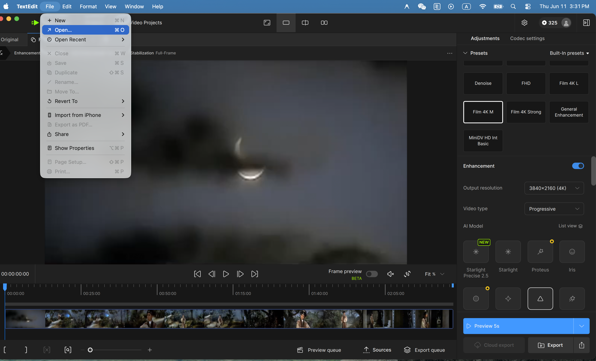
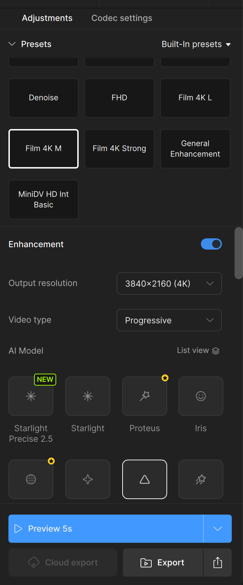
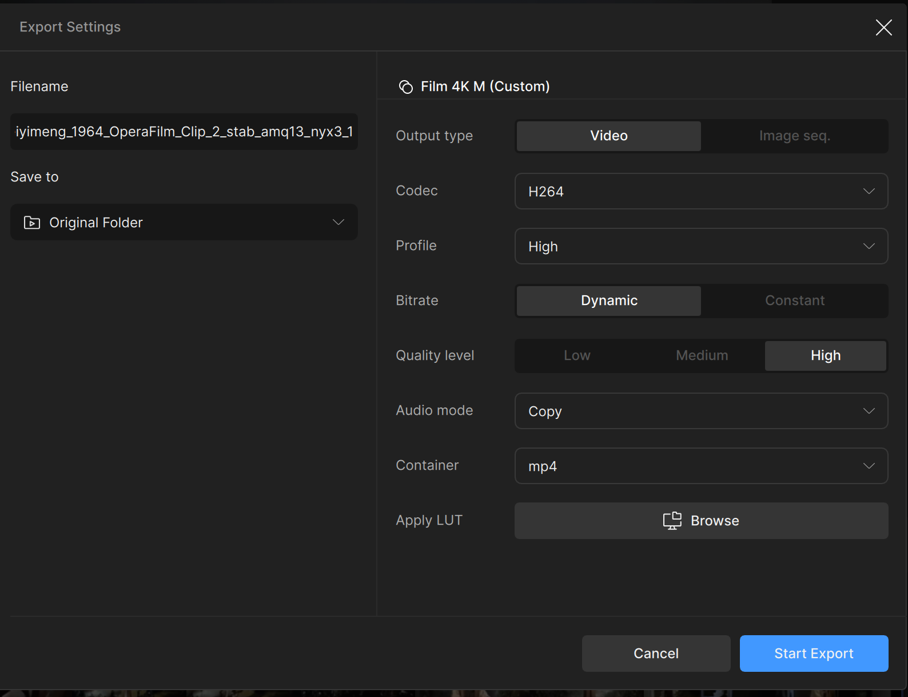

# How to Upscale Videos with Topaz Video AI

Topaz Video AI is a tool that improves the quality of older or low-resolution video clips before they are uploaded to the CTC website. This guide covers the basic workflow for upscaling video clips for web use.

---

## When to Use Topaz

Use Topaz when a video clip:
- Looks blurry or pixelated
- Was recorded in a low resolution (e.g. old film transfers, VHS recordings)
- Has visible noise or grain that distracts from the content

You do **not** need to upscale clips that are already clear and high-resolution.

---

## The Workflow

```
Teams / Source/      →   Topaz Video AI       →   Teams / Processed/   →   Cloudflare R2
────────────────         ─────────────────        ──────────────────       ─────────────
Original raw clip    →   Upscale & export         Save [Name]_2x.mp4   →   Upload for web
                         Save [Name]_2x.mp4   →
```

---

## Step 1 — Download and install Topaz Video AI

1. Go to [topazlabs.com](https://www.topazlabs.com/topaz-video-ai) and download the installer for your operating system (Mac or Windows)
2. Run the installer and follow the on-screen instructions
3. Open the app and sign in with your Topaz account (create one for free if you don't have one)

> **Note:** Topaz Video AI requires a paid license to export video. If you don't have a license, contact the project manager.

---

## Step 2 — Get the source clip

The source clip can come from either place:

- **From Teams** — open **Files / Source / [play-name] / [year]-[type] /** and download the original file to your computer
- **From a local folder** — use the file directly if you already have it on your computer

> Always work from the original source file — never upscale a file that has already been processed.

---

## Step 3 — Open Topaz Video AI

Open **Topaz Video AI** from your Applications folder (Mac) or Start menu (Windows).

---

## Step 4 — Import the video



1. Click **Import** or drag your video file into the Topaz window
2. The clip will appear in the preview panel

---

## Step 5 — Choose the right model



Topaz offers several AI models. Choose based on your clip type:

| Model | Best for |
|---|---|
| **Proteus** | General upscaling — good default choice |
| **Artemis** | Old or heavily degraded footage (VHS, film grain) |
| **Iris** | Close-up faces and fine detail |
| **Nyx** | Very noisy or dark footage |

For most CTC clips (opera films, recorded performances), start with **Proteus**.

### Quick Reference: Preset by Video Quality

| Video Quality | Source Examples | Preset | Output Resolution |
|---|---|---|---|
| **Very Low** | 1950s–60s opera films, onsite performance recordings | *(none)* | 2x |
| **Low** | 1970s–80s TV broadcasts, recorded performances | *(none)* | 2x |
| **Medium** | 1990s–2000s TV productions, MiniDV camcorder recordings | Film 4K M/L / MiniDV HD Int Basic | — |
| **Good** | 2010s+ digital recordings | General Enhancement / FHD | — |

### Second enhancement

Topaz allows you to stack a second enhancement pass on top of the first. Click **Add Enhancement** to open the second enhancement entry and apply an additional model (for example, use **Nyx** to reduce noise after upscaling with **Proteus**).

### Testing with preview

Before running a full export, use the **Preview** function to check how the selected model looks on a short section of the clip. This saves time if the model is not right — adjust and preview again before committing to the full export.

---

## Step 6 — Click Export and configure the Export Settings dialog

Click **Export** — a dialog will appear with filename, save location, and format options.



Configure the following:

**Filename** — use the original source filename and add a suffix indicating the upscaling applied:

| Plan used | Suffix | Example |
|---|---|---|
| 2x output resolution (no preset) | `_2x` | `Mulan_1956_Clip_1_2x.mp4` |
| Film 4K M / Film 4K L / Film 4K Strong | `_4k` | `Mulan_1956_Clip_1_4k.mp4` |
| Other presets | `_enhanced` | `Mulan_1956_Clip_1_enhanced.mp4` |

**Save to** — choose **Browse** and select a convenient folder on your computer.

**Format settings:**
- **Codec:** H.264
- **Quality level:** High
- **Container:** MP4

When ready, click **Start Export** and wait for Topaz to process the clip.

> **CPU processing note:** The CTC workflow uses CPU (not GPU) for upscaling. CPU processing is significantly slower than GPU — expect roughly 30 minutes to 2 hours per minute of video depending on your machine and the model chosen. Heavier models like Film 4K M on an older CPU will take longer. To get a reliable estimate for your setup, run a short 10–15 second test clip first and scale up from there.

---

## Step 7 — Check the result

Before saving to Teams, watch the exported clip and check:
- The image is noticeably clearer than the original
- There are no visual glitches or artifacts (smearing, flickering, strange edges)
- The audio is intact and in sync with the video

If the result looks wrong, try a different model or adjust the settings and export again.

---

## Step 8 — Save to Teams

Upload the exported `_2x` file to **Teams / Processed / [play-name] / [year]-[type] /**.

The file will be picked up from there when it is time to publish it to the website. The Cloudflare R2 upload is a separate step covered in **HOW_TO.md, Section 7**.

---

## Tips

- **Keep the original** — never delete or overwrite the source file in Teams / Source/
- **Clip first, then upscale** — if you only need a short section of a longer video, trim it first before running Topaz (upscaling a shorter clip is much faster)
- **Compare before and after** — Topaz has a split-screen preview; use it to check the improvement before exporting
- **File size** — upscaled files are larger than the originals; aim to keep clips under 100MB for smooth web playback

---

## Need Help?

Contact the project manager if you get stuck at any step.
